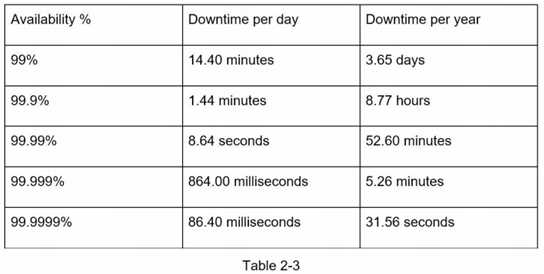

# CHAPTER 2: BACK-OF-THE-ENVELOPE ESTIMATION

You need to have a good sense of scalability basics to effectively carry out back-of-the-envelope estimation. 
```
- Power of two [2]
- Latency numbers every programmer should know
- Availability numbers.
```

 

## (1) Power of two
> To obtain correct calculations, it is critical to know the data volume unit using the power of 2.
```
1. A byte is a sequence of 8 bits.
2. An ASCII character uses one byte of memory (8 bits).
```


## (2) Latency numbers every programmer should know
Dr. Dean from Google reveals the length of typical computer operations in 2010 [1]. 
```
Some numbers are outdated
However, still useful for the fastness and slowness of different computer operations.
```


```
A Google software engineer built a tool to visualize Dr. Dean’s numbers.
The tool also takes the time factor into consideration.
Figures 2-1 shows the visualized latency numbers as of 2020 (source of figures: reference material [3]).
```


```
Conclusions(from Figure 2-1):
• Memory is fast but the disk is slow.
• Avoid disk seeks if possible.
• Simple compression algorithms are fast.
• Compress data before sending it over the internet if possible.
• Data centers are usually in different regions, and it takes time to send data between them.
```
## (3) Availability numbers
```
High availability is the ability of a system to be continuously operational for a desirably long period of time.
High availability is measured as a percentage,
   with 100% means a service that has 0 downtime.
Most services fall between 99% and 100%.
A service level agreement (SLA) is a commonly used term for service providers.
This is an agreement between you (the service provider) and your customer,
and this agreement formally defines the level of uptime your service will deliver.

Cloud providers Amazon [4], Google [5] and Microsoft [6] set their SLAs at 99.9% or above.
Uptime is traditionally measured in nines.
The more the nines, the better. As shown in Table 2-3, the number of nines correlate to the expected system downtime.
```

## Example: Estimate Twitter QPS and storage requirements
```
Please note the following numbers are for this exercise only as they are not real numbers from Twitter.

Assumptions:
•  300 million monthly active users.
•  50% of users use Twitter daily.
•  Users post 2 tweets per day on average.
•  10% of tweets contain media.
•  Data is stored for 5 years.

Estimations:
Query per second (QPS) estimate:
  •  Daily active users (DAU) = 300 million * 50% = 150 million
  •  Tweets QPS = 150 million * 2 tweets / 24 hour / 3600 seconds = ~3500
  •  Peek QPS = 2 * QPS = ~7000

We will only estimate media storage here.
  •  Average tweet size:
    •  tweet_id   64 bytes
    •  text          140 bytes
    •  media      1 MB
  •  Media storage: 150 million * 2 * 10% * 1 MB = 30 TB per day
  •  5-year media storage: 30 TB * 365 * 5 = ~55 PB
```

### Tips
```
Back-of-the-envelope estimation is all about the process.
Solving the problem is more important than obtaining results.
Interviewers may test your problem-solving skills.

Here are a few tips to follow:
  • Rounding and Approximation.
   It is difficult to perform complicated math operations during the interview.
     For example, what is the result of “99987 / 9.1”?
     There is no need to spend valuable time to solve complicated math problems.
     Precision is not expected. Use round numbers and approximation to your advantage.
     The division question can be simplified as follows: “100,000 / 10”.
  • Write down your assumptions.
     It is a good idea to write down your assumptions to be referenced later.
  • Label your units.
     When you write down “5”, does it mean 5 KB or 5 MB?
     You might confuse yourself with this. Write down the units because “5 MB” helps to remove ambiguity.
  • Commonly asked back-of-the-envelope estimations: QPS, peak QPS, storage, cache, number of servers, etc.
    You can practice these calculations when preparing for an interview. Practice makes perfect.
```

