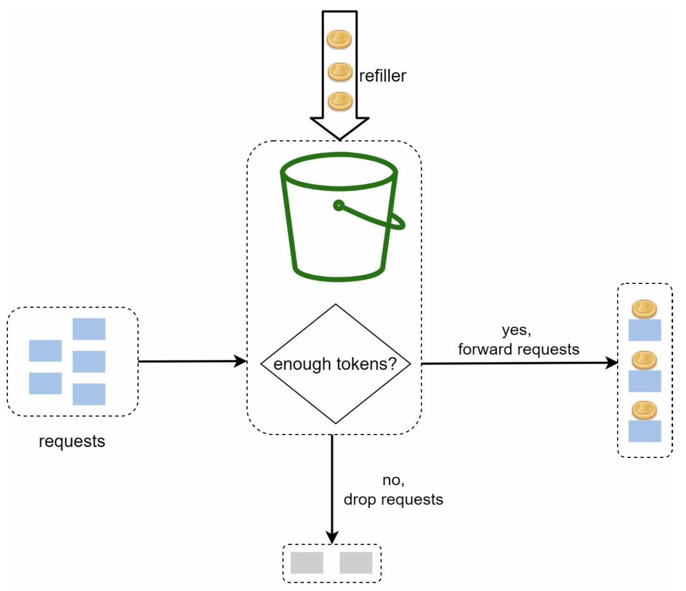
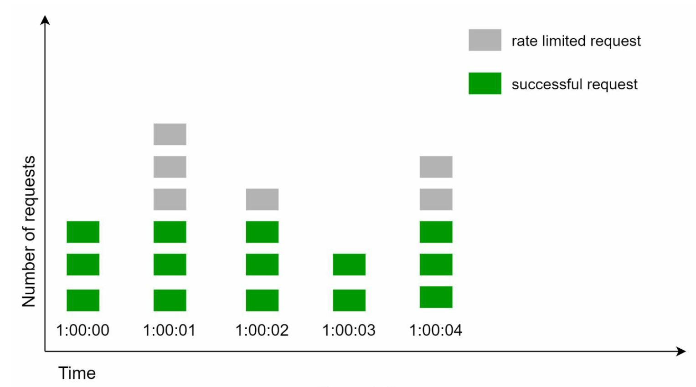
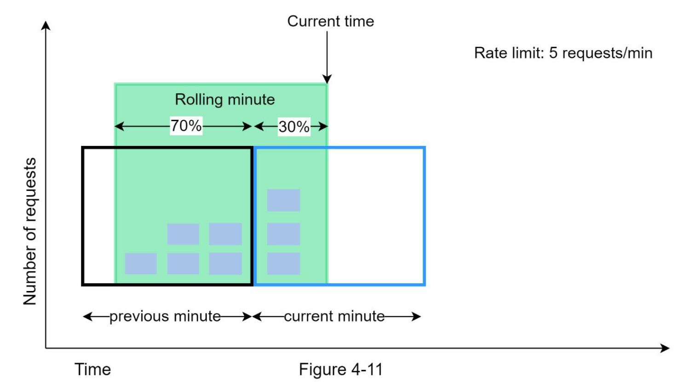
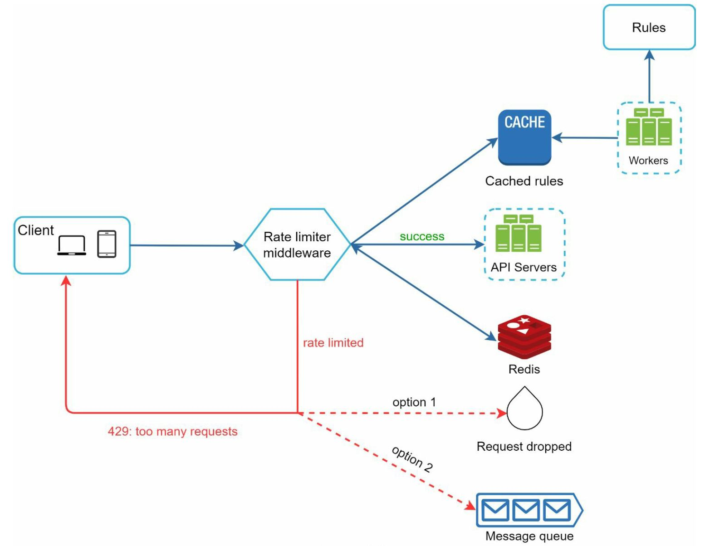
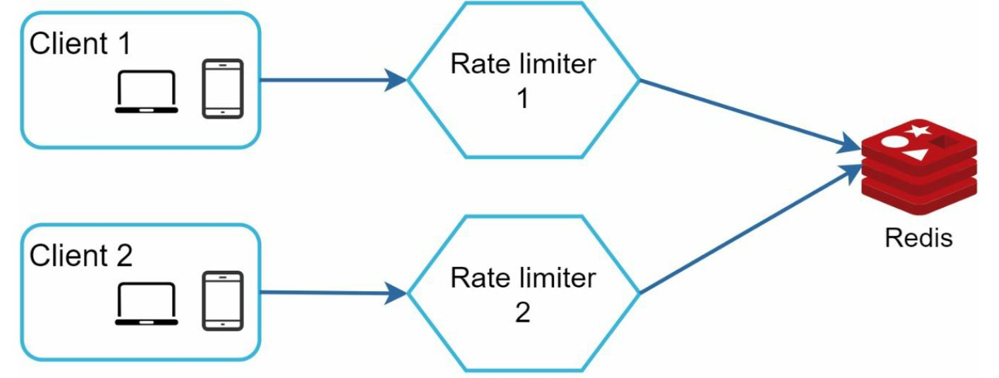

# C04 Design a rate limiter

a rate limiter is used to control the rate of traffic sent by a client or a service.

## The benefits of using an API rate limiter

1.  Prevent resource starvation caused by DoS attck
2.  Reduce cost
3.  Prevent servers from being overload

## Where to put the rate limiter

- Client-side : but client requests can easily be forged by malicious actors.
- Server-side
  
- Beside the client and server side : we create a rate limiter middleware
  

## Algorithms for rate limiting

- Token bucket
   - Amazon and Stripe use the Token bucket - bucket algorithm takes two parameter Bucket size and Refill rate - Pros - The algorithm is easy to implement. - Memory effcient. - Token bucket allow a burst of traffic for short periods. A request can go through as long as there are tokens left. - Cons - Two parameters in the algorithm are bucket size and token refill rate. However, it might be challenging to tune them properly

- Leaking bucket algorithm
   - It is usually implemented with FIFO queue - When a request arrives, the system checks if the queue is full. if it is not full, the request is added to the queue. - Otherwise, the request is dropped - Requests are pulled from the queue and processed at regular intervals. - Pros - Memory efficient given the limited queue size - Requests are processed at a fixed rate therefore it is suitable for use cases that a stable outflow rate is needed. - Cons - A burst of traffic fills up the queue with old requests, and if they are not processed in time, recent requests will be rate limited.
  there are two parameters in the algorithm. It might not be easy to tune them properly.

- Fixed window counter algorithm
   - works as follows - The algorithm divides the timeline into fix-sized time windom and assign a counter for each window. - Each request increments the counter by one. - Once the counter reaches the pre-defined threshold, new requents - Pros - Memory efficient. - Easy to understand. - Resetting available quota at the end of a unit time window fits certain use cases. - Cons - Spike in traffic at the edges of a window could cause more requests than the allowed quota to go through.

- Sliding window log algorithm
  
  As discussed previously, the fixed window counter algorithm has a major issue calous more requests to go through at the edges of a window. The sliding window log algorithm fixes the issue. - The algorithm keeps track of request timestamps. Timestamp data is usually kept in cache, such as sorted sets of Redis. - When a new request comes in, remove all the outdated time-snes. udred imestamps are defined as those older than the start of the current time window. - Add timestamp of the new request to the log. - If the log size is the same or lower than the allowed count, a request is accepted. Otherwise, it is rejected. - Pros - Rate limiting implemented by this algorithm is very accurate. In any rolling window, requests will not exceed the rate limit. - Cons
  The algorithm consumes a lot of memory because even if a request is rejected, its timestamp might still be stored in memory.

- Sliding window counter algorithm
  Hybrid approach that combines the fixed window counter and sliding window log. This algorithm can be implemented by two different approaches, but we explain only one of them for now.

In the below example, the rate limiter allows a maximum of 7 request per minute, and there are 5 requests in the previous minute and 3 in the current minute.
The number of request in the rolling window is calculated using this formula:

- **Requests in current window + requests in the previous window \* overlap percentage of the rolling window and previous window**

Using this formula, we get 3 + 5 \* 0.7% = 6.5 requests. Depending on the use case, the number can be either be rounded up or down.


> Pros and Cons

Pros:

- It smooths out spikes in traffic because the rate is based on the average rate of the previous window
- Memory efficient

Cons:

- It only works for no-so-strict look back window. It is an approximation of the actual rate because it assumes requests in the previous window are evenly distributed.
  _But according to experiments done by Cloudflare, only 0.003% of requests are wrongly allowed or rate limited among 400 million requests_

#### High-level architecture

We need a counter to keep track of how many requests are sent from the same user, IP address, etc. IF the counter is larger than the limit, the request is disallowed.

In-memory cache is chosen to store the counters because it is fast and supports time-based expiration strategy.

> An example of rate limiting implemented with Redis

Redis is an in-memory store that offers two commands: INCR and EXPIRE.

- INCR: It increases the stored counter by 1
- EXPIRE: It sets a timeout for the counter. If the timeout expires, the counter is automatically deleted

### Step 3 - Design deep dive

- How are rate limiting rules created? Where are the rules stored?
- How to handle requests that are rate limited?

#### Rate limiting rules

Below is Lyft's open-sourced rate limiting component

```yaml
domain: messaging
descriptors:
  - key: message_type
    Value: marketing
    rate_limit:
      unit: day
      requests_per_unit: 5
```

Another example:

```yaml
domain: auth
descriptors:
  - key: auth_type
    Value: login
    rate_limit:
      unit: minute
      requests_per_unit: 5
```

These kinds of rules are generally written in configuration files and saved on disk.

#### Exceeding the rate limit

If a request is rate limited, APIs return a HTTP response 429(too many requests) to the client. We may enqueue the rate-limited requests to be processed later.

##### Rate limiter headers

Clients will know whether it's being throttled or the number of allowed remaining request before being throttled by looking into HTTP response headers.

_X-Ratelimit-Remaining_: THe remaining number of allowed requests within the window
_X-Ratelimit-Limit_: It indicates how many calls the client can make per time window
_X-Ratelimit-Retry-After_: The number of seconds to wait until you can make a request again without being throttled

When a user has sent too many requests(when the request is rate limited), the user will get 429 error and _X-Ratelimit-Retry-After_ header.

#### Detailed design



- Rules are stored on the disk. Workers frequently pull rules from the disk and store them in the cache
- When a client sends a request to the server, the request is sent to the rate limiter middleware first
- Rate limiter middleware loads rules from the cache. It fetches counters and last request timestamp from Redis cache. Based on the response, the rate limiter decides:
  - if the request is not rate limited, it is forwarded to API servers
  - if the request is rate limited, the rate limiter returns 429 requests error to the client. In the meantime, the request is either dropped or forwarded to the queue

#### Rate limiter in a distributed environment

Building a rate limiter in a single server environment is not difficult. But scaling the system to support multiple servers and concurrent threads is a different story.
Two challenges we will encounter:

- Race condition
- Synchronization issue

##### Race condition

Rate limiter

- reads the counter value from Redis
- check if (counter + 1) exceeds the threshold
- if not, increment the counter value by 1 in Redis

Below example shows the race condition can happen in a highly concurrent environment.

Locks are the most obvious solution for solving race condition. However, locks will significantly slow down the system. Two common strategies to solve this problem are:

- Lua script
- Sorted sets data structure in Redis

#### Synchronization issue

To support millions of users, one rate limiter server might not be enough to handle the traffic. When multiple rate limiter servers are used, synchronization is required.

In the below example, because web tier is stateless, clients can send requests to a different rate limiter even when its first request sent to the another one. If no synchronization happens, rate limiter 1 does not contain any data about client 2.


One possible solution is to use sticky sessions that allow a client to send traffic to the same rate limiter. But this is not scalable or flexible. A better approach is to use centralized data stores like below.


#### Performance optimization

Two areas to improve:

- **Multi-data setup**: it's crucial for a rate limiter because latency is high for users located far away from the data center
- **Synchronization of data with an eventual consistency model**

#### Monitoring

By monitoring rate limiter's performance, we want to make sure:

- The rate limiting algorithm is effective
  - It could be ineffective when there is a sudden increase in traffic
- The rate limiting rules are effective
  - If the rules are too strict, many valid requests are dropped

### Step 4 - Wrap up

We discussed

- different algorithms and its pros/cons
- system architecture
- rate limiter in a distributed environment
- performance optimization and monitoring

There are more talking points we can mention if time allows:

- Hard vs soft rate limiting
  - **Hard**: The number of requests cannot exceed the threshold
  - **Soft**: Requests can exceed the threshold for a short period
- Rate limiting at different levels
  - Rate limiting can be applied at other layers rather than HTTP(layer 7)
    - IP address(layer 3)
- Avoid being rate limited. Design our client with best practices:
  - Use client cache to avoid making frequent API calls
  - Understand the limit and do not send too many requests in a short time frame
  - Include code to catch exceptions or errors so our client can gracefully recover from exceptions
  - Add sufficient back off time to retry logic
