# CHAPTER 5: DESIGN CONSISTENT HASHING
To achieve horizontal scaling, it is important to distribute requests/data efficiently and evenly across servers. 

### The rehashing problem
If you have n  cache servers, a common way to balance the load is to use the following hash method:
> serverIndex = hash(key) % N, where N is the size of the server pool.

Let us use an example to illustrate how it works.
As shown in Table 5-1, we have 4 servers and 8 string keys with their hashes.

> To fetch the server where a key is stored, we perform the modular operation f(key) % 4.


```
This approach works well when the size of the server pool is fixed, and the data distribution is even.
```
> However, problems arise when new servers are added, or existing servers are removed.
```
For example, if server 1 goes offline, the size of the server pool becomes 3.
Using the same hash function, we get the same hash value for a key.
But applying modular operation gives us different server indexes because the number of servers is reduced by 1.
We get the results as shown in Table 5-2 by applying hash % 3:
```
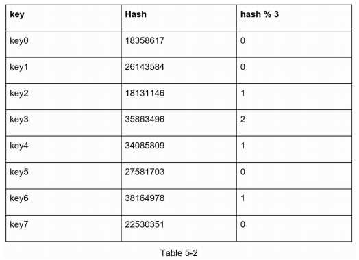
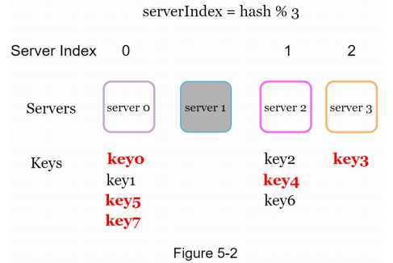
```
Most keys are redistributed, not just the ones originally stored in the offline server (server 1).
This means that when server 1 goes offline, most cache clients will connect to the wrong servers to fetch data.
This causes a storm of cache misses.
```
> 🔥**Consistent hashing is an effective technique to mitigate this problem.**

## Consistent hashing
### Hash space and hash ring
```
Now we understand the definition of consistent hashing, let us find out how it works.
Assume SHA-1 is used as the hash function f, and the output range of the hash function is: x0, x1, x2, x3, …, xn.
In cryptography, SHA-1’s hash space goes from 0 to 2^160 - 1.
That means
  • x0 -> 0
  • xn -> 2^160 – 1
  • all the other hash values in the middle fall
```
By collecting both ends, we get a hash ring as shown in Figure 5-4:
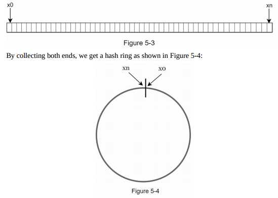

### Hash servers
Using the same hash function f, we map servers based on server IP or name onto the ring. 

Figure 5-5 shows that 4 servers are mapped on the hash ring.
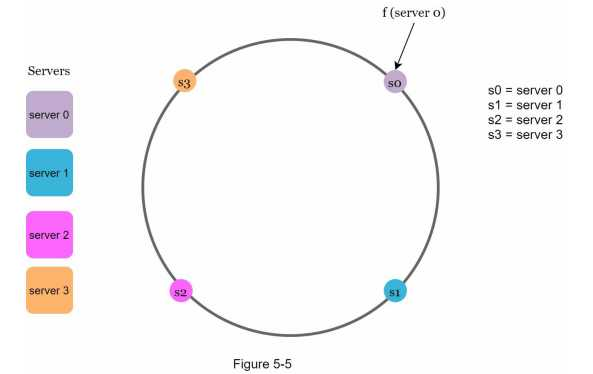

### Hash keys
One thing worth mentioning is that hash function used here is different from the one in “the rehashing problem,” 
  and there is no modular operation. As shown in Figure 5-6, 4 cache keys (key0, key1, key2, and key3) are hashed onto the hash ring
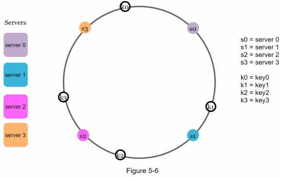  
```
To determine which server a key is stored on, we go clockwise from the key position on the ring until a server is found.
Figure 5-7 explains this process.
Going clockwise,
  key0  is stored on server 0;
  key1 is stored on server 1;
  key2 is stored on server 2;
  key3 is stored on server3.
```
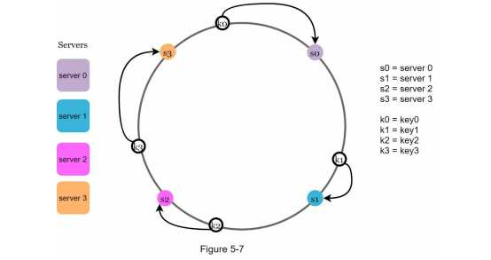  
### Add a server
Adding a new server will only require redistribution of a fraction of keys.
```
In Figure 5-8, after a new server 4 is added, only key0 needs to be redistributed. k1, k2, and k3 remain on the same servers.
Let us take a close look at the logic.
(Before)
  Before server 4 is added, key0 is stored on server 0.
(Now) 
  Now, key0 will be stored on server 4
       because server 4 is the first server it encounters by going clockwise from key0’s position on the ring.
The other keys are not redistributed based on consistent hashing algorithm.
```
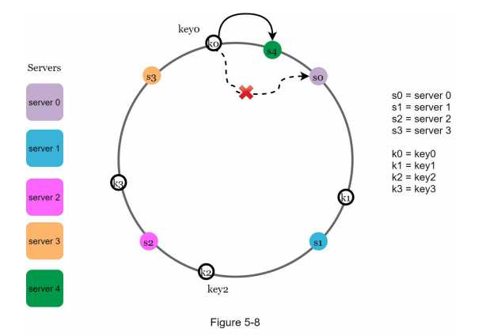 
### Remove a server
```
When a server is removed, only a small fraction of keys require redistribution with consistent hashing.
In Figure 5-9, when server 1 is removed, only key1 must be remapped to server 2. 
The rest of the keys are unaffected.
```
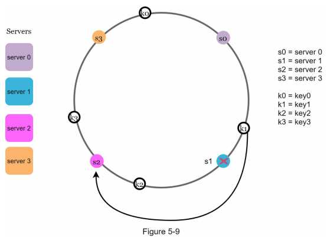  

### Two issues in the basic approach
```
The consistent hashing algorithm was introduced by Karger et al. at MIT.
The basic steps are:
  • Map servers and keys onto the ring using a uniformly distributed hash function.
  • To find out which server a key is mapped to, go clockwise from the key position
      until the first server on the ring is found.
```
🔥 Two identified problems
```
👿First,
   it is impossible to keep the same size of partitions on the ring for all servers considering a server can be added or removed.
   A partition is the hash space between adjacent servers.
   It is possible that the size of the partitions on the ring assigned to each server is very small or fairly large.
   In Figure 5-10,
    if s1 is removed, s2’s partition (highlighted with the bidirectional arrows) is twice as large as s0 and s3’s partition.
```
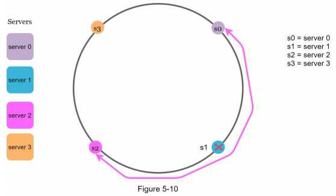  
```
👿Second, it is possible to have a non-uniform key distribution on the ring.
  For instance, if servers are mapped to positions listed in Figure 5-11, most of the keys are stored on server 2. 
  However, server 1 and server 3 have no data.
```
 


### A Solutions(called Virtual Nodes or Replicas)
### Virtual nodes(Replicas)
```
A virtual node refers to the real node, and each server is represented by multiple virtual nodes on the ring. 
In Figure 5-12, both server 0 and server 1 have 3 virtual nodes. 
The 3 is arbitrarily chosen; and in real-world systems, the number of virtual nodes is much larger. 
Instead of using s0, we have s0_0, s0_1, and s0_2 to represent server 0 on the ring. 
Similarly, s1_0, s1_1, and s1_2 represent server 1 on the ring.
    With virtual nodes, each server is responsible for multiple partitions. 
Partitions (edges) with label s0 are managed by server 0. 
On the other hand, partitions with label s1 are managed by server 1.
```
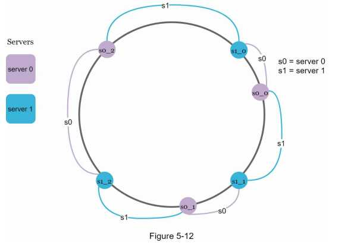 
```
To find which server a key is stored on,
    we go clockwise from the key’s location and find the first virtual node encountered on the ring.
In Figure 5-13, to find out which server k0 is stored on,
    we go clockwise from k0’s location and find virtual node s1_1, which refers to server 1.
```
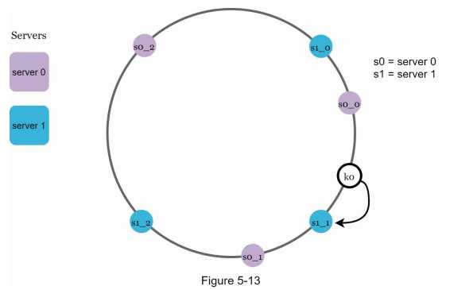 
```
As the number of virtual nodes increases, the distribution of keys becomes more balanced. 
This is because the standard deviation gets smaller with more virtual nodes, leading to balanced data distribution.
Standard deviation measures how data are spread out.
The outcome of an experiment carried out by online research [2] shows that with one or two hundred virtual nodes,
the standard deviation is between 5% (200 virtual nodes) and 10% (100 virtual nodes) of the mean.
The standard deviation will be smaller when we increase the number of virtual nodes.
However, more spaces are needed to store data about virtual nodes. 
This is a tradeoff, and we can tune the number of virtual nodes to fit our system requirements.
```
### Find affected keys
When a server is added or removed, a fraction of data needs to be redistributed.

How can we find the affected range to redistribute the keys?

##### Adding
```
Server 4 is added onto the ring(Figure 5-14). The affected range starts from s4 (newly added node)
and moves anticlockwise around the ring until a server is found (s3).
Thus, keys located between s3 and s4 need to be redistributed to s4.
```
 
##### Removing
```
When a server (s1) is removed as shown(Figure 5-15),
the affected range starts from s1 (removed node) and moves anticlockwise around the ring until a server is found (s0).
Thus, keys located between s0 and s1 must be redistributed to s2.
```
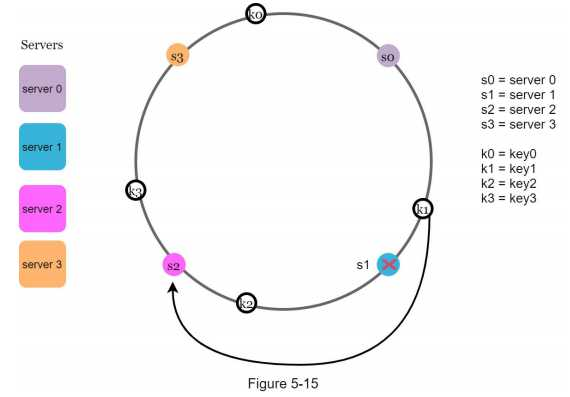 

### Wrap up

The benefits of consistent hashing include:
```
• Minimized keys are redistributed when servers are added or removed.
• It is easy to scale horizontally because data are more evenly distributed.
• Mitigate hotspot key problem. Excessive access to a specific shard could cause server overload. 
```

Imagine data for Katy Perry, Justin Bieber, and Lady Gaga all end up on the same shard. 

Consistent hashing helps to mitigate the problem by distributing the data more evenly.

Consistent hashing is widely used in real-world systems, including some notable ones:
```
• Partitioning component of Amazon’s Dynamo database [3]
• Data partitioning across the cluster in Apache Cassandra [4]
• Discord chat application [5]
• Akamai content delivery network [6]
• Maglev network load balancer [7]
```
