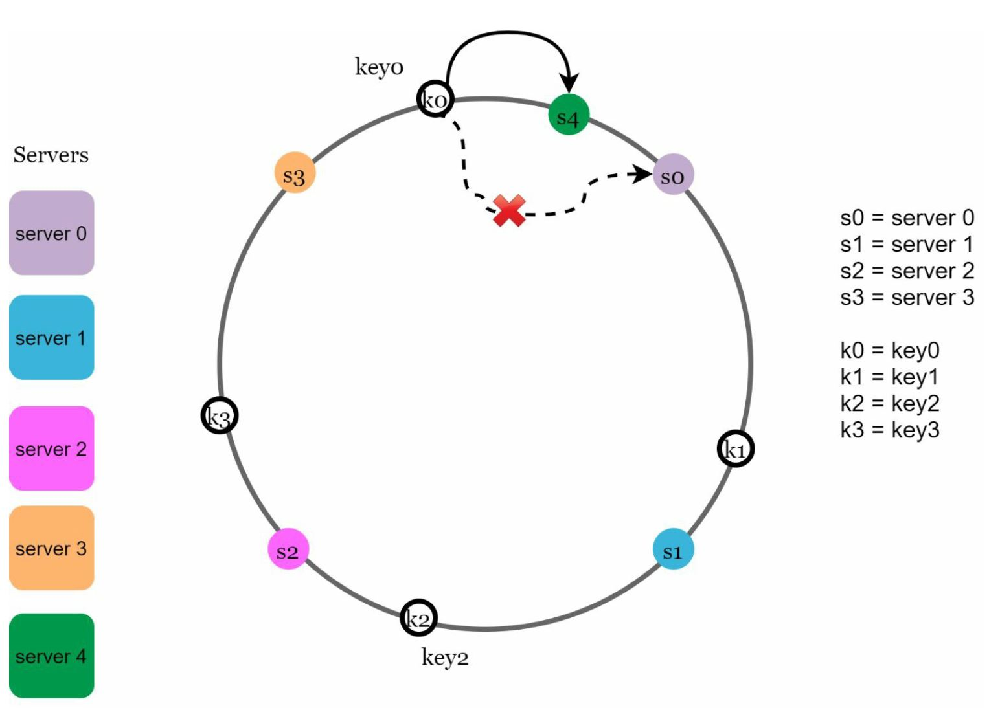
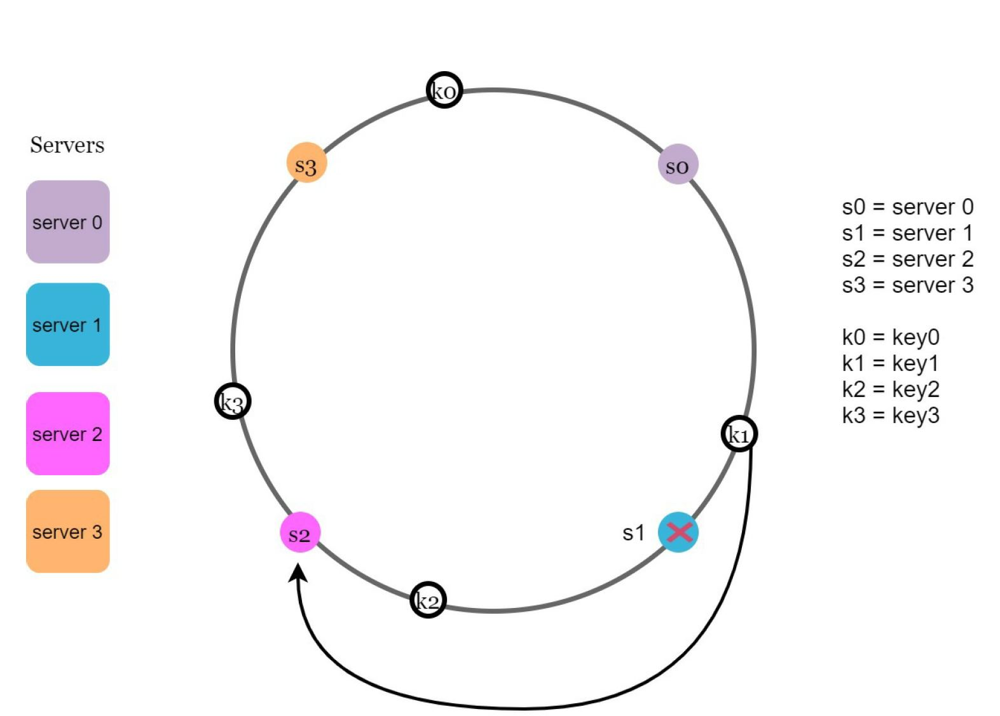

# Chapter 05 Design Consistent Hashing

To achive horizontal scaling, it is important to distribute request/data efficiently and evnely across servers.

### The rehashing problem

#### Two issues in the basic approch

Basic steps of consistent hashing algorithm:

- Map servers and keys on to the ring using a uniformly distributed hash function
- To find out which server a key is mapped to, go clockwise from the key position until the first server on the ring is found

this approch make obove problem

1.  It is impossible to keep the same size of partitions on the ring for all servers considering a server can be added or removed

For example, in the below figure, if _s1_ is removed, _s2_'s partition is twice as large as _s0_ and _s3_'s partition.

2. It is possible to have a non-uniform key distribution on the ring

For example, if servers are mapped to positions like below figure, most of the keys are stored on _server 2_, but _server 1_ and _server 3_ have no data.

We use **virtual nodes** or **replicas** to solve these problems.

#### virtual nodes

A virtual node refers to the real node.

In the below figure, _s0_ and _s1_ has 3 virtual nodes each. Instead of _s0_, we have _s0_0_, _s0_1_, and _s0_2_ to represent _server 0_ on the ring and similar to _server 1_. With virtual nodes, each server is responsible for multiple partitions. Partitions(edges) with label _s0_ are managed by server 0.

To find which server a key is stored on, we go clockwise from the key's location and find the **first virtual node encountered** on the ring.

#### Find affected keys

When a server is added or removed, how can we find the affected range to redistribute the keys?

In the below figure, _server 4_ is added onto the ring. The affected range starts from _s4_(newly added node) and moves anticlockwise around the ring until a server is found(_s3_). Thus, keys located between _s3_ and _s4_ need to be redistributed to _s4_.

In the below figure, _server 1_ is removed from the ring. The affected range starts from _s1_(removed node) and moves anticlockwise around the ring until a server is found(_s0_). Thus keys located between _s0_ and _s1_ must be redistributed to _s2_.

### Wrap up

The benefits of consistent hashing:

- Minimized keys are redistributed when servers are added or removed
- Easy to scale horizontally because data are more evenly distributed
- Mitigate hotspot key problem by distributing data more evenly; excessive access to a specific shard could cause server overload

Use cases in real-world systems:

- Partitioning components of Amazon's DynamoDB
- Data partitioning across the cluster in Apache Cassandra
- Discord chat application
- Akamai content delivery network
- Maglev network load balancer
