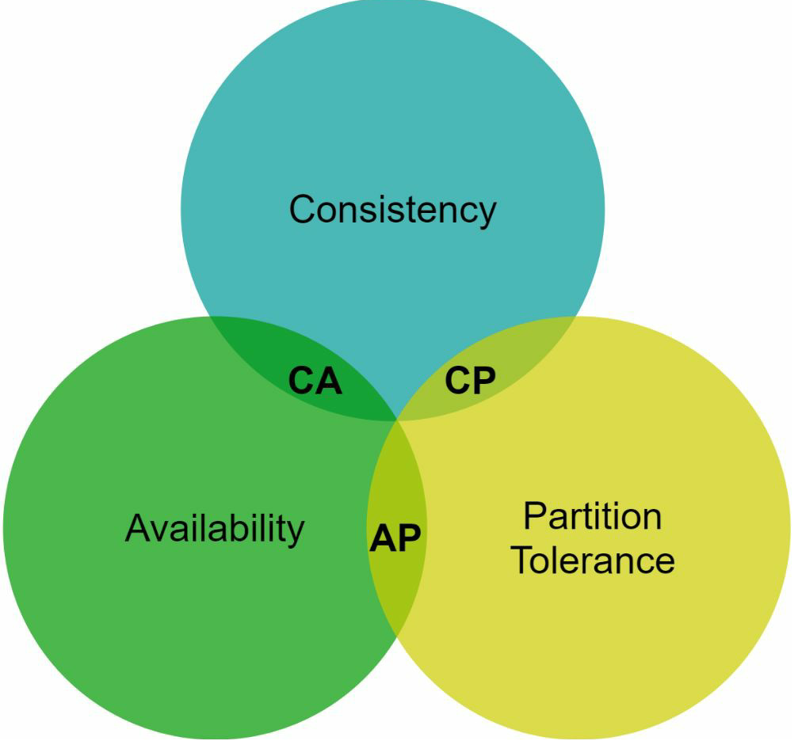
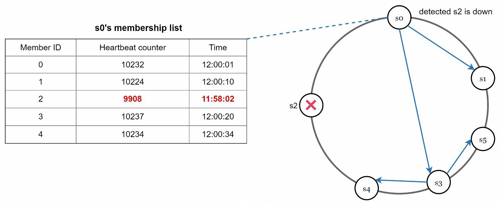
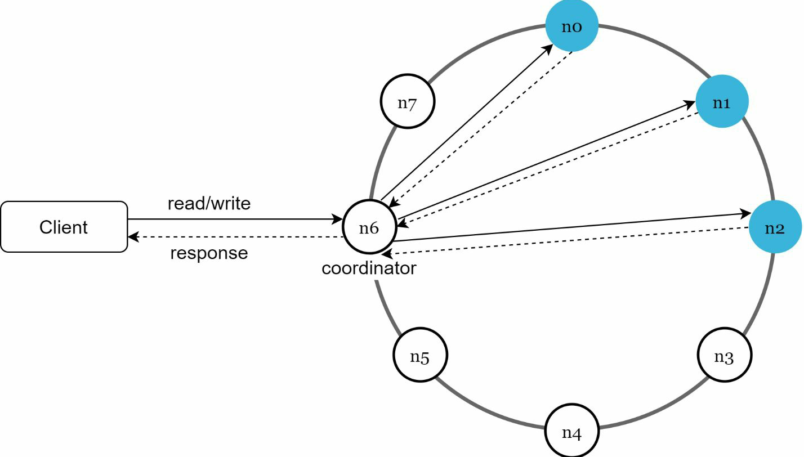
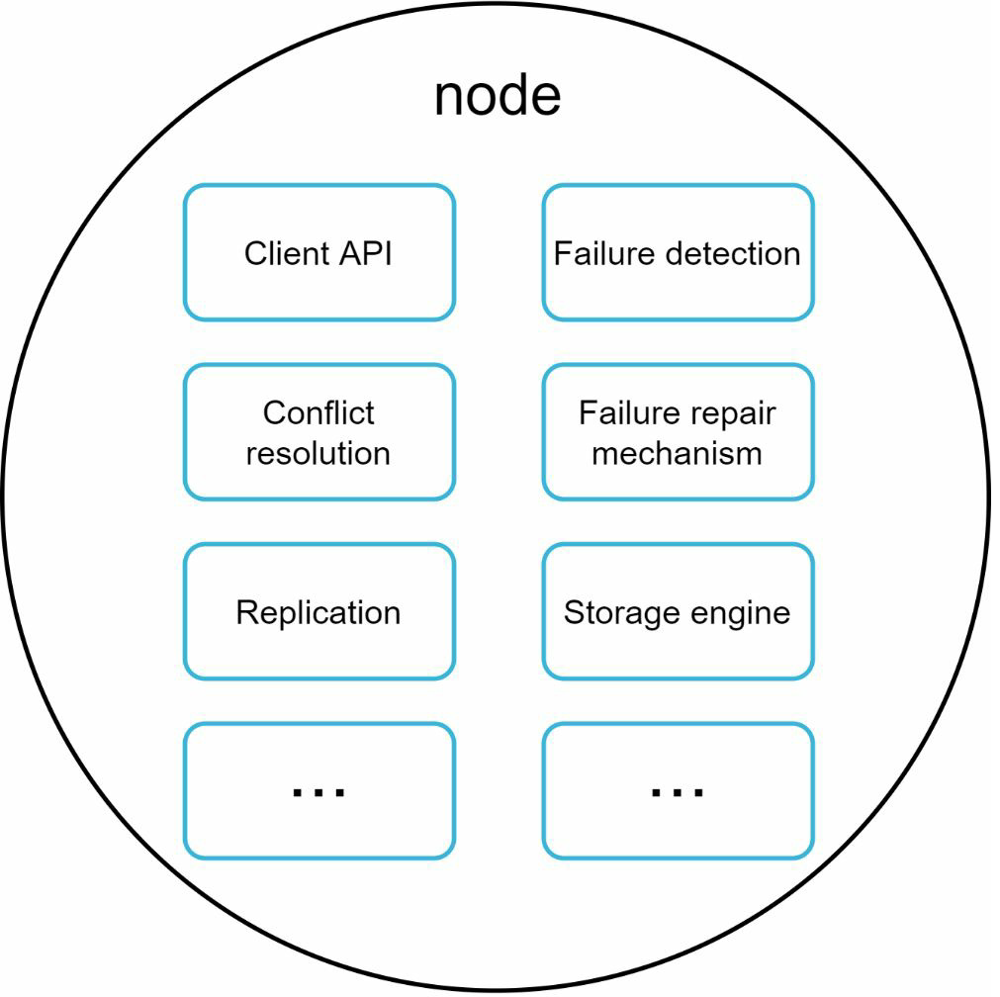
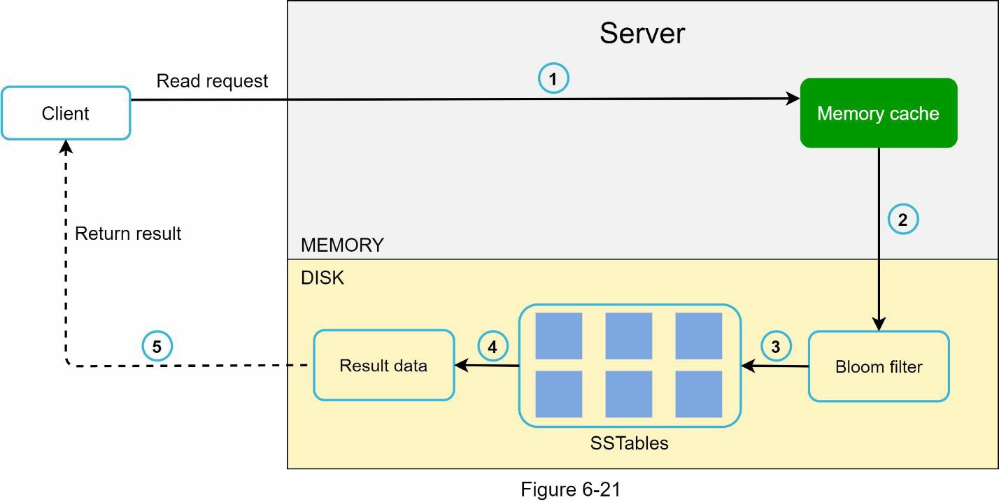

# Chapter 06 Design a key-value store

A key-value store or key-value database, is a non-relational database.
Each unique identifier is stored as a key with its associated value. This paring is known as a "key-value" pair

- key : key can be plain text or hashed value. for perfomance
- value : can be strings, list, objects, etc

### Understand the problem and establish design scope

> there is no goal. Each design achieves a specific balance regarding the tradeoffs of the read, write, and memory usage. or consistency and availability

- the size of a key-value pair is small: less than 10KB
- Ability to store big data
- High availablilty : the system responds quickly, even during failures.
- High scalability: The system can be scaled to support large data set.
- Automatic scaling: The addition/deltion of servers should be automatic based on traffic
- Tunable consistency
- Low latency

### Single server key-value store

Developing a key-value store that resides in a single server is easy.
but space constraint make that impossible. so two optimizations can be done to fit more data in a single server.

- Data compression
- Store only frequently used data in memory and the rest on disk

### Distributed key-value store

> When desigining a distributed system, it is important to understand CAP (Consistency, Availability, Partition Tolerance) theorem.

#### CAP theorem

- Consistency : consistency means all clients see the same data at the same time no matter which node they connect to.

- Availaability: availability means any client which requests data gets a response even if some of the nodes are down.

- Partition Tolerance: a partition indicates a communication break between two nodes. Partition tolerance means the system continues to operate despite network partitions

CAP theorem states that one of the three properties must be sacrifced to support 2 of the 3 properties

Nowadays, key-value stores are classified based on the two CAP characteristics they support;

- CP (consistency and partition tolerance) system: sacrificing availability

- AP (availability and partition tolerance) system: sacrificing consistency.

- CA (consistency and availability) system: sacrificing partition tolerance. Since network failure is unavoidable, a didstributed system must tolerate network partition. Thus, a CA system cannot exist in real-world application.

##### Ideal situation

In the ideal world, network partition never occurs. Data written to _n1_ is automatically replicated to _n2_ and _n3_. Both consistency and availability are achived.

##### Real-world distributed systems

### System components

#### Data partition

Two challenges while partitioning data:

1. Distribute data across multiple servers evenly
2. Minimize data movement when nodes are added or removed
   **Consistent hashing** is a great technique to solve these problems.
   

> Advantages of using consistent hashing
> **Automatic scaling**: servers could be added and removed automatically depending on the load
> **Heterogeneity**: the number of virtual nodes for a server is proportional to the server capacity

#### Data replication

For high availability and reliability, data must be replicated asynchronously over N servers. After a key is mapped to a position on the hash ring, the first N servers by walking clockwise on the ring will be chosen.

> If we use virtual nodes, the first N nodes may be owned by fewer than N physical servers. To avoid this issue, we only choose unique servers.

#### Consistency

Since data is replicated at multiple nodes, it must be synchronized across replicas.
**QUorum consensus** can guarantee consistency for both read and write operations.

**N** = the number of replicas
**W** = a write quorum of size _W_. For a write operation to be considered as successful, write operation must be acknowledged from _W_ replicas
**R** = a read quorum of size _R_. For a read operation to be considered as successful, read operation mut wait for responses from at least _R_ replicas

If _N_ = 3,

_W = 1_ means that the coordinator must receive at least one acknowledgement before the write operation is considered as successful. If we get an acknowledgement from s1, we no longer need to wait for acknowledgements from s0 and s2. **A coordinator acts as a proxy between client and nodes.**

The configuration of W, R and N is typical tradeoff between latency and consistency.
If

- W = 1 or R = 1, an operation is returned quickly because coordinator only needs to wait for a response from any of the replicas
- W or R > 1, the system offers better consistency, but the query will be slower because the coordinator must wait for the response from the slowest replica
- W + R > N, strong consistency is guaranteed because must be at least one overlapping node that has the latest data to ensure consistency

Some possible setups to configure N, W, and R
If

- R = 1 and W = N, the system is optimized for **fast read**
- W = 1 and R = N, the system is optimized for **fast write**
- W + R > N, **strong consistency** is guaranteed
- W + R <= N, strong consistency is **NOT** guaranteed

#### Consistency models

A consistency model defines the degree of data consistency.
Possible consistency models;

- Strong consistency: any read operation returns a value of the most updated write data item
- Weak consistency: subsequent read operations may not see the most updated value
- Eventual consistency: a specific form of weak consistency. Given enough time, all updates are propagated, and all replicas are consistent

Strong consistency is usually achieved by forcing a replica not to accept new reads/writes until every replica has agreed on current write. But this approach is **not ideal** because it could block new operations.

Dynamo and Cassandra adopt eventual consistency.

#### Inconsistency resolution: versioning

Treating each data modification as a new immutable version of data.

Below is how inconsistency happens:

n1 and n2 have the same value, hence server 1 and server 2 will get the same value for get operation

Server 1 changes the name to "johnSanfrancisco" and server 2 changes the name to "johnNewYork". These changes are performed simultaneously. We have conflicting values, called version v1 and v2.

A **vector clock** is a common technique to solve this problem. A vector clock is a _[server, version]_ pair associated with a data item.

Let _D([S1, v1], [S2, v2],...,[Sn, vn])_, where D is a data item, v1 is a version counter, and s1 is a server number. If data item D is written to server Si, the system must perform one of the following tasks:

- Increment vi if [Si, vi] exists
- Otherwise, create a new entry [Si, 1]

Using vector clocks, we can easily tell D([s0, 1], [s1, 1]) is an ancestor of D([s0, 2], [s1, 2]). Similarly, we can tell there is a conflict between D([s0, 1], [s1, 2]) and D([s0, 2], [s1, 1]).

Vector clocks still have two notable downsides;

1. it adds complexity to the client because it needs to implement conflict resolution logic
2. the _[server:version]_ pairs could grow rapidly. To fix this, we set a threshold for the length, and if it exceeds the limit, the oldest pairs are removed. This can lead to inefficiencies in reconciliation because the descendant relationship cannot be determined accurately

#### Handling failures

Common failure resolution strategies:

##### Failure detection

In a distributed system, we need at least two independent sources of information to mark a server down.

> all-to-all multi-casting (inefficient)

A better solution is **gossip protocol**. It works as follows:

- Each node maintains a node membership list, which contains member IDs and heartbeat counters
- Each node periodically increments its heartbeat counter
- Each node periodically sends heartbeats to a set of random nodes, which in turn propagate to another set of nodes
- Once nodes receive heartbeats, membership list is updated to the latest info
- If the heartbeat has not increased for more than predefined periods, th member is considered as offline
  

#### Handling temporary failures

After failures have been detected through the gossip protocol, the system needs to deploy certain mechanisms to ensure availability.

**Sloppy quorum**
Instead of enforcing the quorum requirement, the system chooses the first _W_ healthy servers for writes and first _R_ healthy servers for reads on the hash ring. Offline servers are ignored.

##### Hint handoff

If a server is unavailable due to network or server failures, another server will process requests temporarily. When the down server is up, changes will be pushed back to achieve data consistency.

#### Handling permanent failures

##### Anti-entropy protocol

Anti-entropy protocol compares each piece of data on replicas and update each replica to the newest version. A [Merkle tree](https://en.wikipedia.org/wiki/Merkle_tree) is used for inconsistency detection and minimizing the amount of data transferred.

The following is how to build a Merkle tree assuming the key space is from 1 to 12:

Step 1: divide key space into buckets(4, example). A bucket is used as the root level node to maintain a limited depth of the tree

Step 2: hash each key in a bucket using a uniform hashing method

Step 3: create a single hash node per bucket

Step 4: build the tree upwards till root by calculating hashes of children

If root hashes of two Merkle trees match, both servers have the same data. If root hashes disagree, then the left child hashes are compared followed by right child hashes. We can traverse the tree to find which buckets are not synchronized and synchronize those buckets only.

Using Merkle trees, the amount of data needed to be synchronized is proportional to the differences between the two replicas, and not the amount of data they contain.

#### Handling data center outage

Replicate data across multiple data center!

#### System architecture diagram

#### Write path

The below is what happens after a write request is directed to a specific node.

1. The write request is persisted on commit log file
2. Data is saved in the memory cache
3. When the memory cache is full or reaches a predefined threshold, data is flushed to SSTable(Sorted Strings Table) on disk.
   [SSTable by Scylla](<https://www.scylladb.com/glossary/sstable/#:~:text=Sorted%20Strings%20Table%20(SSTable)%20is,ordered%2C%20immutable%20set%20of%20files.>)

#### Read path

After a read request is directed to a specific node, it first checks if the data is in the memory cache. If so, the data is returned to the client.

If it is not in the memory, it will be retrieved from the disk instead.

1. The system checks if the data is in the memory
2. If the data is not in the memory, the system checks the bloom filter
3. The bloom filter is used to figure out which SSTables might contain the key
4. SSTables return the result of the data set
5. The result of the data set is returned to the client

#### Summary

