# Chapter 14: Design youtube
- Design Youtube : Can be applied to other interview questions like desing a video sharing platform such as Netflix and Hulu. 
- Design looks simply (upload / play), but it is not really
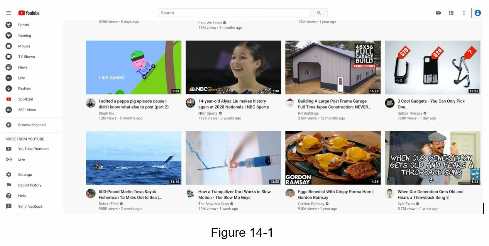
- Statistics about youtube
  - Total number of monthly active users: 2 billion
  - Number of video watched per day: 5 billion
  - 73% of US adults use Youtube
  - 50 million creators on Youtube
  - Ad revenue was $15.1 billion for the fully year 2019, up 36% from 2018
  - Youtube is responsible for 37% of all mobile internet traffic
  - Youtube is available in 80 different languages

## Step 1 - Understand the problem and establish design scope
- There are many features in Youtube like comment, share, like a video, save a video to playlists, subscribe to a channel.
- It's not easy to design all of it just 1 session, so ask questions and narrow down the scope
### Questions and answers
- What features are import?
  - Ability to upload a video and watch a video
- What client do we need to support?
  - Mobile app, web browers and smart TV
- How many daily active users do we have?
  - 5 million
- What is the average daily time spent on the product?
  - 30 minutes
- Do we need to support international users?
  - Yes, a large percentage of users are international users
- What are the supported video resolutions?
  - The system accepts most of the video resolutions and formats
- Is encryption required?
  - Yes
- Any file size requirement for video?
  - Our platform focuses on small and medium-sized videos. The maximum allowed video size is 1GB
- Can we leverage some of the existing cloud infrastructures provided by Amazon, Google, or Microsoft?
  - That's great questoin. Building everything from scratch is unrealistic for most companies, it's recommended to leverage some of existin cloud serviecs.

### Focusing features
- Ability to upload video fast
- Smooth video streaming
- Ability to change video quality
- Low infrastructure cost
- High availability, scalability, and reliability requirements
- Client supported: mobile apps, web browser and smart TV

### Back of the envelope estimation
- Assume the product has 5 million daily active users(DAU)
- Users watch 5 videos per day
- 10% of users upload 1 video per day
- Assume the average video size is 300 MB
- Total daily storage space needed: 5 million x 10% x 300MB = 150TB
- CDN cost
  - When cloud CDN servers a video, you are charged for data transferred out of the CDN
  - Amazons's CDN CloudFront for cost estimation - Assume 100% of traffic is servered from the US. The average cost per GB is $0.02. For simplicity, we only calculate the cost of video streaming.
  - 5 million x 5 videos x 0.3 GB x $0.02 = $150,000 per day.

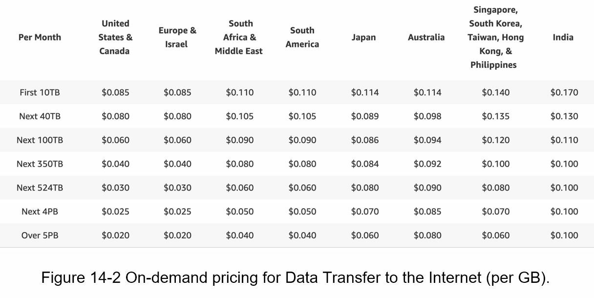

## Step 2 - Propose high-level design and get buy-in
- Do not build everything, leverage existing cloud service. Why?
  - System design interview are not about building everyting from scratch
    - Just enough mention blob storage for storing source videos
  - Building scalable blob storage or CDN is extremely complex and costly, even big company like Netflix and Facebook use cloud service

- CDN : Videos are stored in CDN. When you play, a video is streamed from the CDN
- API servers: Everything else except video streaming goes through API servers
- Two flows
  - Video uploading flow
  - Video streaming flow

### Video uploading flow
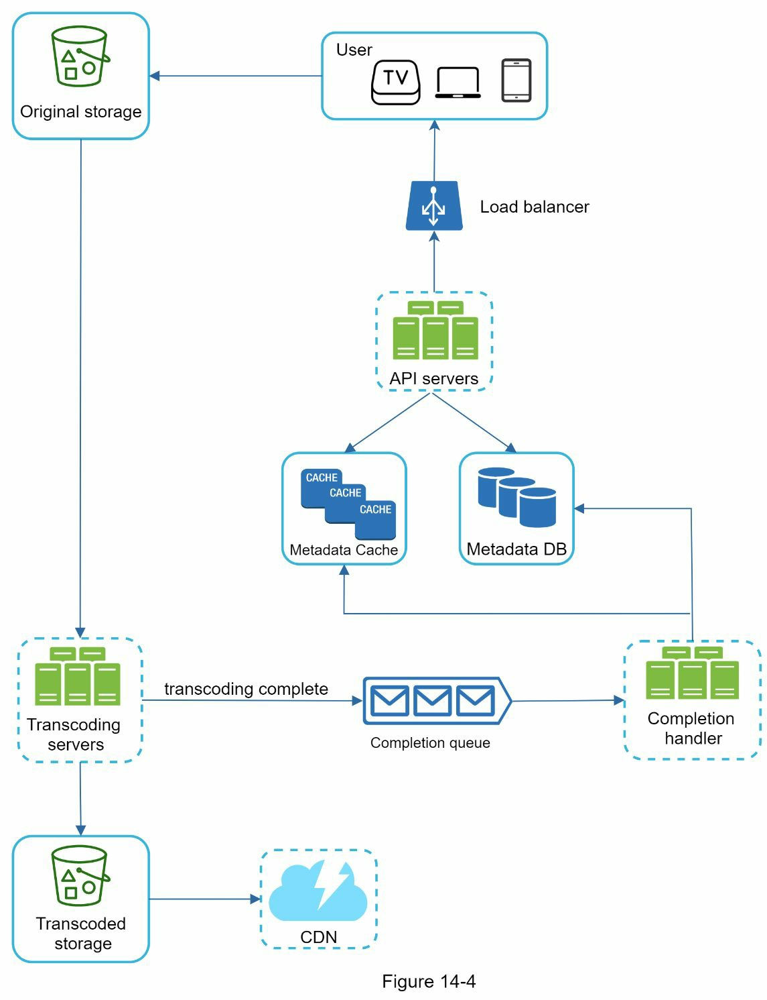
It consists of the following components
- Load balancer: Evenly distributes requests among API servers
- API Servers: All user requests go through API servers except video streaming
- Metadata DB: Video metadata are stored. Shared / Replicated to meet performance and high availability requirements
- Metadata Cache: For better performance
- Transcoding servers: Video Encoding, the process of converting a video format to ohter format(MPEG, HLS, etc) which provide the best video streams possible for different devices and bandwith capabilities.
- Transcoded storage 
- CDN: Videos are cached in CDN
- Completion queue: Message queue that store information about video transcoding completion events
- Completion handler: Consist of a list of workers that pull event data from the completion queue and update metadata cache and database. 

#### Flow a: upload the actual video
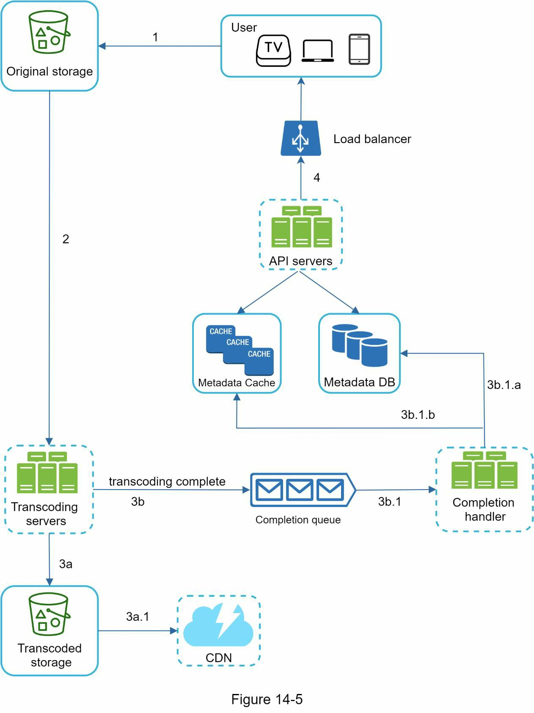
1. Videos are uploaded to the original storage
2. Transcoding servers fetch videos from the original storage and start transcoding
3. Once transcoding is complete, two steps are execute in parallel
   1. Transcoded video are sent to transcoded storage
      1. Transcoded videos are distributed to CDN
   2. Transcoding completion events are queued in the completion queue.
      1. Completion handler contains a bunch of workers that continuously pull event data from the queue
         1. Completion handler updates the metadata database and cache when video transcoding is compelete
4. API servers inform the client that the video is successfully uploaded and is ready for streaming

#### Flow b: update the metadata
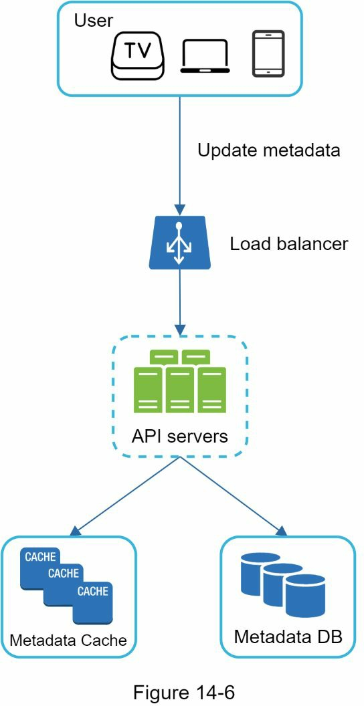
- While a file is being uploaded to the original storage, the client in parallel sends s request to update the video metadata.

### Video streaming flow
- Downloading vs Streaming
- Streaming means your device continuously receives video streams from remote source videos
- Streaming protocol
  - MPEG-DASH: Moving picture experts group & Dynamic Adaptive Streaming over HTTP
  - Apple HLS: HTTP Live Streaming
  - Microsoft Smooth Streaming
  - Adobe HTTP Dynamic Streaming(HDS)
- Different streaming protocols support different video encodings and playback players

## Step 3 - Design deep dive

### Video transcoding
- Video must be encoded into compatible bitrates and formats for other devices
  - Bitrates - the rate at which bits are processed over time. The higher bitrate generally means higher video quality
  - High bitrates streams need more processing power and fast internet spped
- Video transcoding is important for the following reasons
  - Raw video consumes large amount of storage space
  - Many devices and browser only support certain types of video format.
  - Network conditions
- Many types of encoding formats are available and they have two parts
  - Container: basket that contians video files, audio, and metadata, like avi, mov, mp4
  - Codecs: Compression and decompression algorithm, like H.264, VP9, and HEVC

### Directed acyclic graph (DAG) model
- Transcoding a video has lots of step, different requirement from creator.
- To support different video processing pieplines and maintain high parallelism, it's important to add some level of abstraction and let client programmers define what tasks to execute. 
- Facebook's streaming video engine uses a directed acyclic graph(DAG) programming model.

- Inspection : Make sure video have good quality and are not malformed.
- Watermark : An image overlay on top of your video contains identifying information about your video.
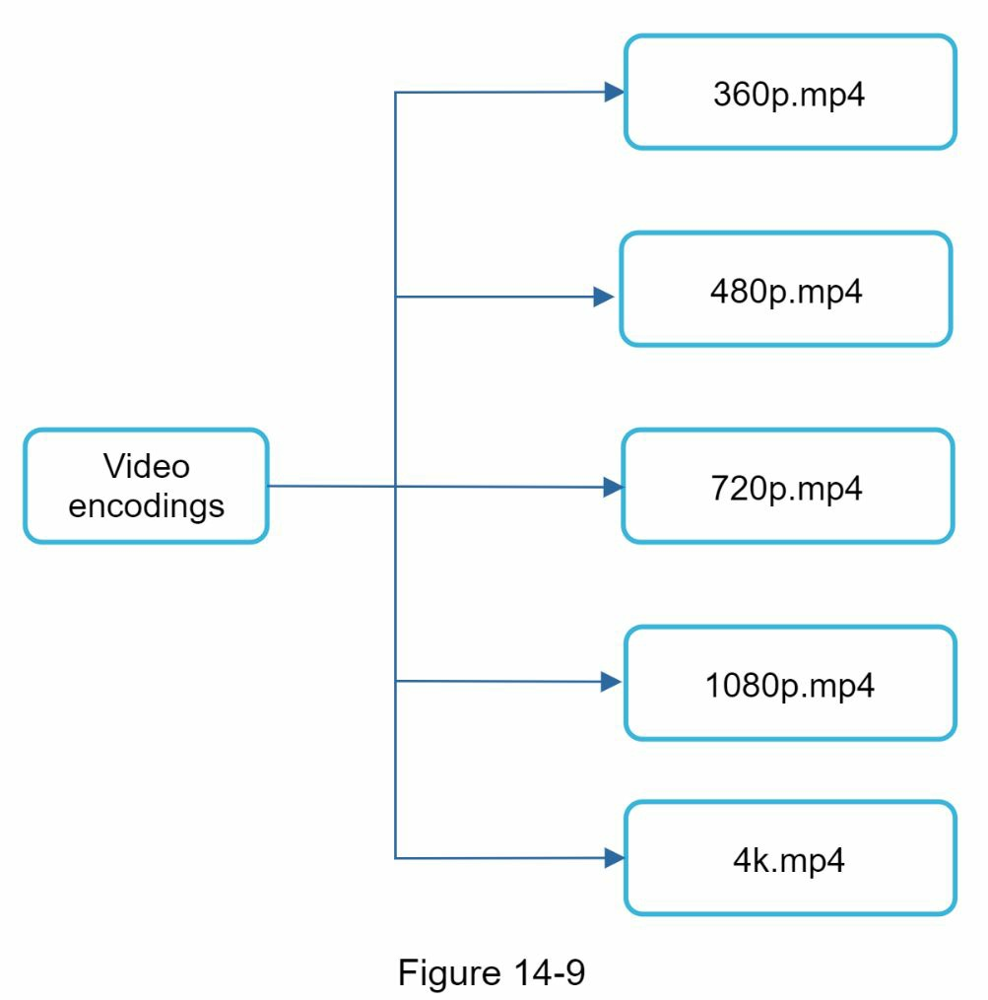

### Video transcoding architecture
- The proposed video transcoding architecture that leverages the cloud services
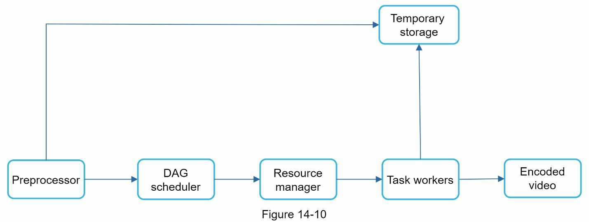

#### Preprocessor

- Preprocessor has 4 responsibilites
  - Video spliting : Split into smaller Group of Pictures(GOP) alignment. 
    - GOP is group/chunk of frames arranged in a specific order
  - Some old mobile devcies or browsers might not support video spliting. 
  - DAG generation

  - Cache data: For better reliability, the preprocessor stores GOPs and metadata in temporary storage

#### DAG scheduler
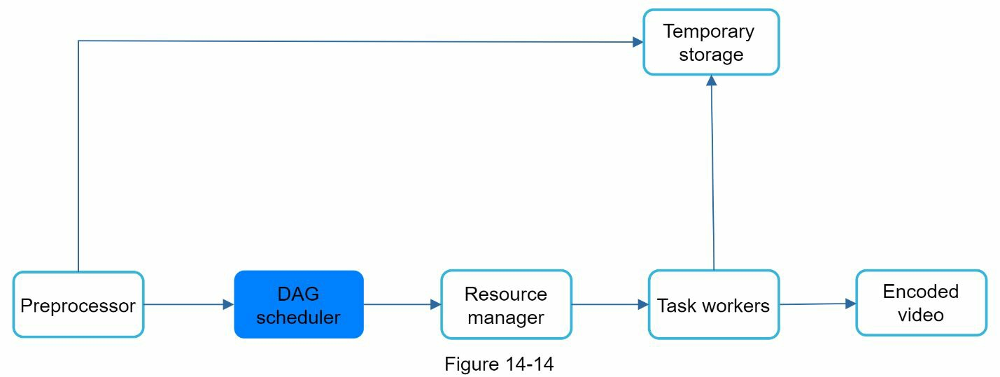
- Splits a DAG graph into stages of tasks and puts them in the task queue in the resource manager

- The original vidoe is split into three stages
  - Stage 1: video, audio, and metadata
  - Stage 2: video file is further split into two tasks in stage2 : encoding and thumbnail. And audio also requires audio encoding

#### Resource manager
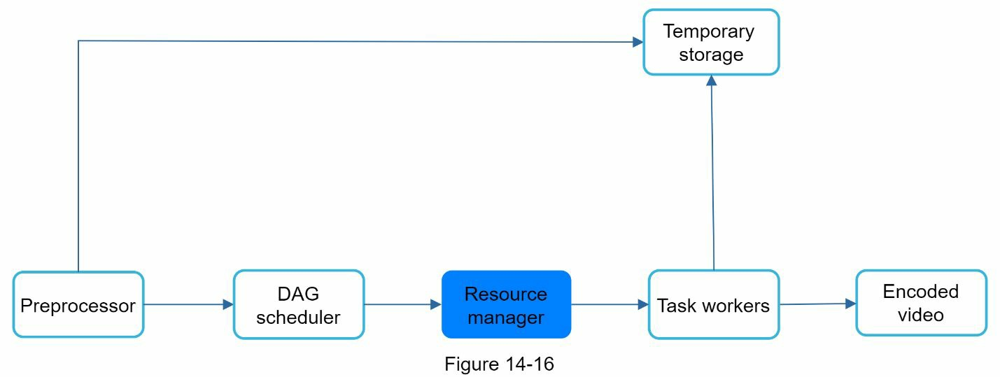
- Resource manager is responsible for managing the efficiency of resource allocation
- Contains 3 queues and a task scheduler 
    - Taks queue : priority queue that contains tasks to be executed
    - Worker queue : prioirty queue that contains worker utilization info
    - Running queue: currently running tasks and workers running the tasks
    - Task scheduler: It picks the optimal task/worker, and instruct the chosen task workers to execute the job

#### Task workers

- Task workers run the tasks which are defined in the DAG. Different workers may run different task.:w
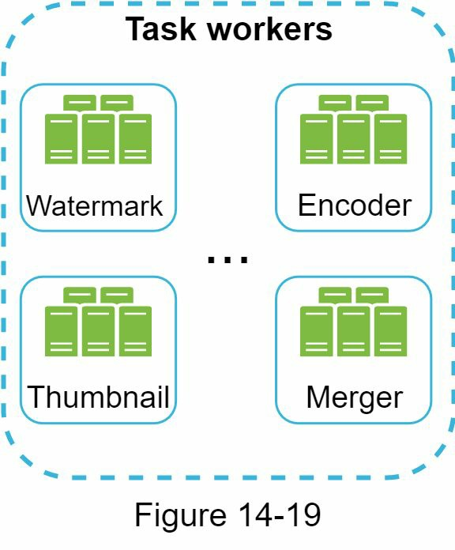

#### Temporary storage

- Multiple storage systems are used here. And choice of storage system depends on factors like data type, size, access frequency, data life span, etc.
- Metadata: size small , frequently used  -> in memory
- Video & audio data: big size -> blob storage

#### Encoded video
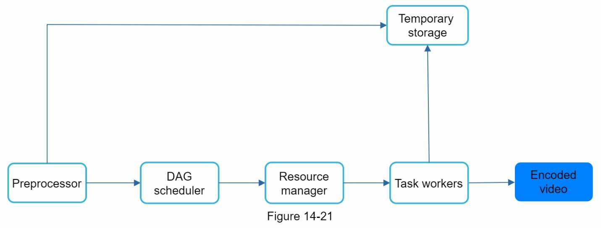
- Encoded video is the final output of the encoding pipeline

### System optimization
#### Speed optimization : parallelize video uploading
- Uploading a video as a whole unit is inefficient. Can split a video into smaller chunks by GOP alignment

- This allows fast resumable uploads when the previous upload failed

#### Speed optimizatoin: place upload center close to users
- Another way to improve the upload speed is by setting up multiple upload centers across the globe.

#### Speed optimization: parallelism everywhere
- One way for optimizatoin is to build a loosely coupled system and enable high parallelism
- Below steps are hard to make the system parallel
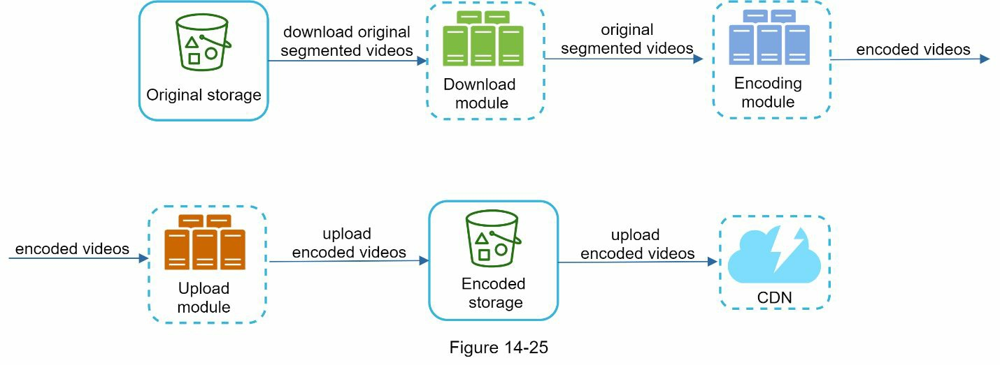
- To make the system more loosely coupled, we introduce message queues as below.
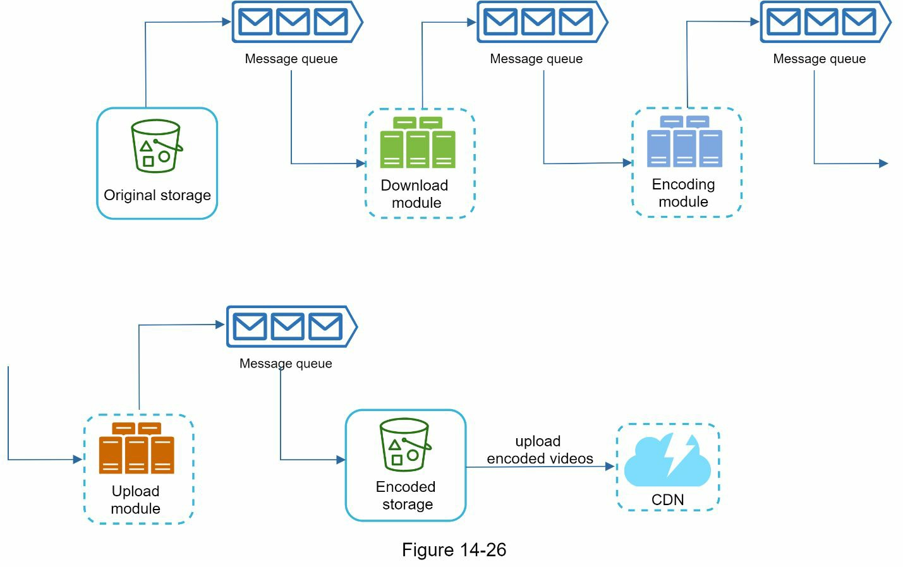
- Each module does not need to wait for the output of the download moduel anymore. 

#### Safety optimization: pre-signed upload URL
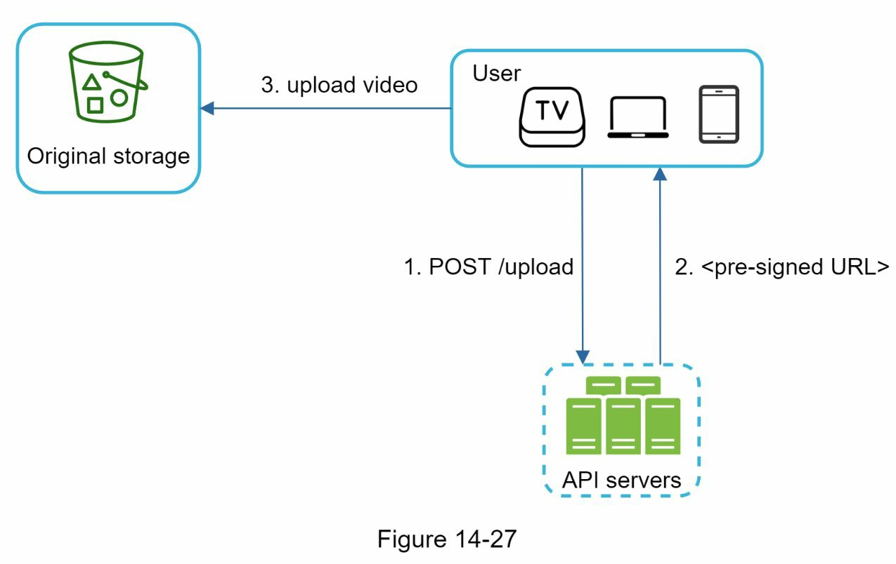
- The client makes a HTTP request  to API servers to fetch the pre-signed URL, which gives the access permission to the object identified in the URL
  - The term pre-signed URL is used by uploading file to Amazon S3. Other cloud service provides might use a different name
- API servers response with a pre-signed URL
- Once the client receives the response, it uploads the video using the pre-signed URL

#### Safety optimization: protect your videos
- To protect copyrighted videos, we can adopt one of the following three safety options
  - Digital rights management(DRM) : Apple FairPlay, Google Widevine, Mircosoft PlayReady
  - AES encryption
  - Visual watermarking

#### Cost-saving optimization
- How can we reduce the cost when using CDN which is expensive, especially when the data size is large
- Youtube video stream follow long-tail distribution. A few popular videos are accessed frequently but many others have few or no viewers. Optimize based on this fact.
1. Only server the most popular video from CDN and other video from our high capacity storage servers
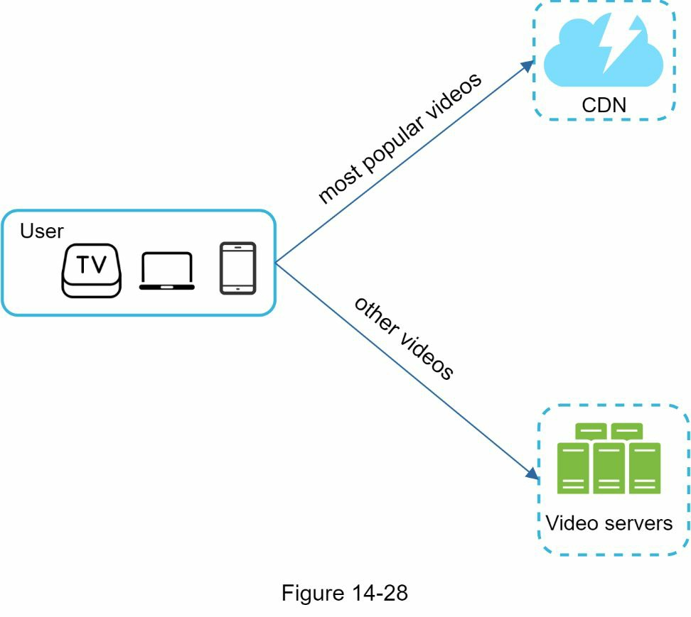
2. For less contents, we many not need to store many encoded video version. Do on-demand
3. Some videos are popular only in certain regions. There are not to be distributed
4. Building own CDN

- Consider content popularity, user access pattern, video size,...

### Error handling
- For a large-scale system, system errors are unavoidable and those are should be handled
  - Recoverable error - Retry the operation a few times. If continues to fail then return a proper error code to the client.
  - Non-recoverable error - like mulformed video format. Stop and returns the proper error code to client

- Typical errors for each system component and how to cover
  - Upload error: retry a few times
  - Split video error
  - Transcoding error : retry
  - Preprocessor error : regenerate DAG diagram
  - DAG scheduler error: reschedule a task
  - Resource manager queue down: use a replica
  - Taks woker down: try the task on a new worker
  - API server down: API servers are stateless so request will be directed to a different API server
  - Metadata cache server down: Data is replicated. Access other node to fetch data
  - Meatadata DB server down
    - Master is down - promote one of the slaves to act as the new master
    - Slave is down - use another slave for read and bring up another DB server to replace the this

## Step 4 - Wrap up
- Additional points
  - Scale the API
  - Scale the database
  - Live streaming - process / record / broadcase in real time
  - Video takedown