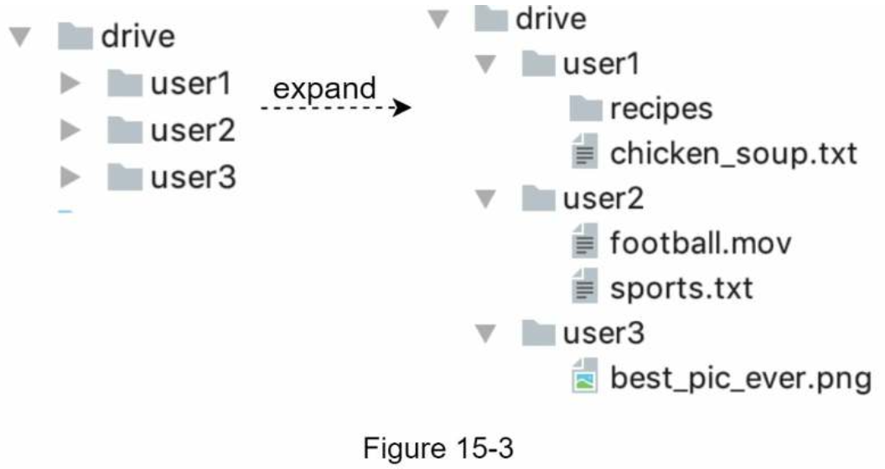
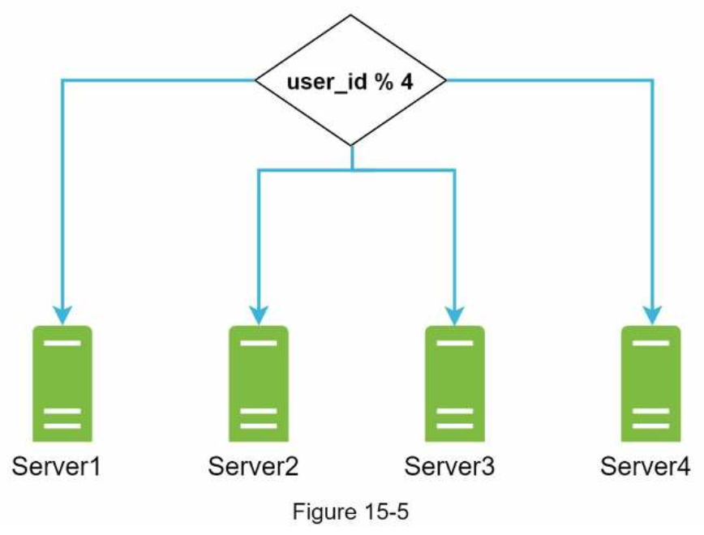
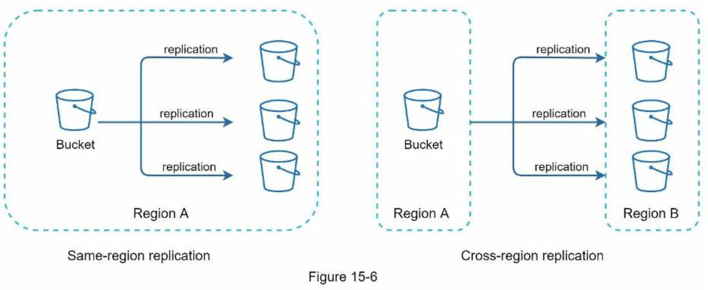
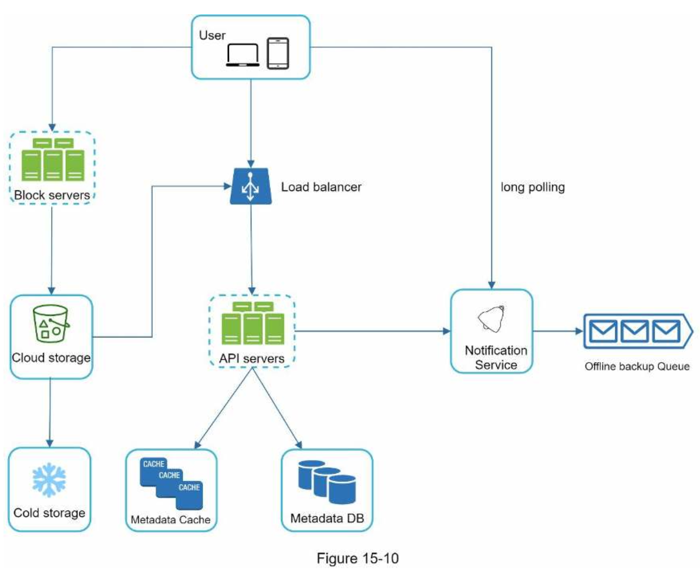
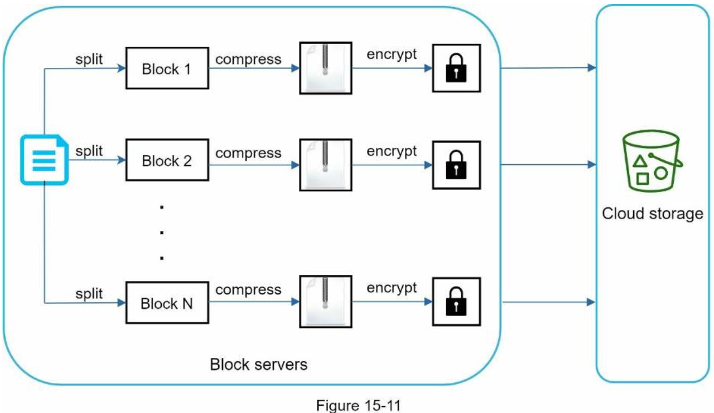
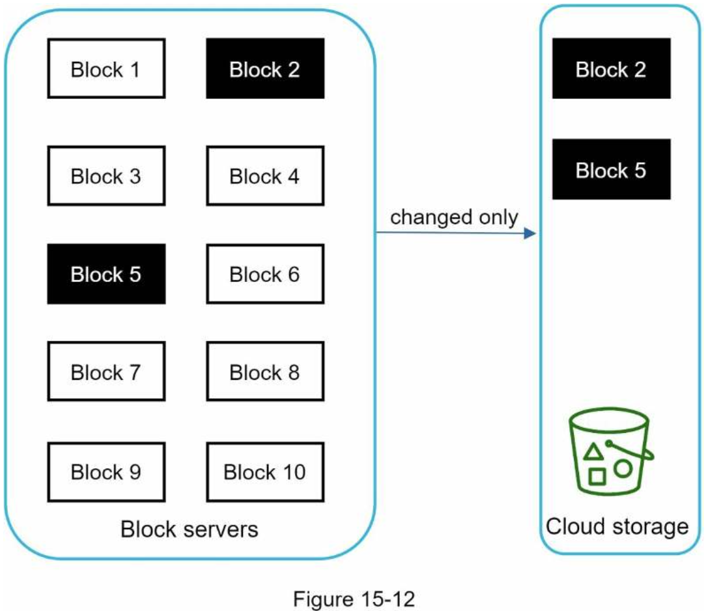
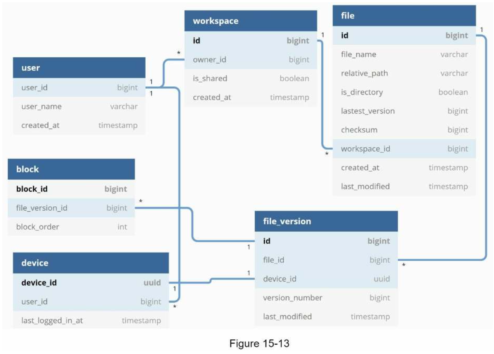
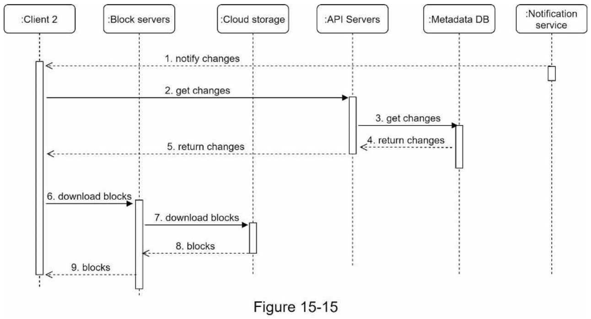

# 15. DESIGN GOOGLE DRIVE
### Step 1 - Understand the problem and establish design scope
---
##### Features
- Add files. The easiest way to add a file is to drag and drop a file into Google drive.
- Download files.
- Sync files across multiple devices. When a file is added to one device, it is automatically synced to other devices.
- See file revisions.
- Share files with your friends, family, and coworkers
- Send a notification when a file is edited, deleted, or shared with you.

##### Out of our design scope
- Google doc editing and collaboration. Google doc allows multiple people to edit the same document simultaneously.

##### Non-functional requirements
- Reliability. Reliability is extremely important for a storage system. Data loss is unacceptable.
- Fast sync speed. If file sync takes too much time, users will become impatient and abandon the product.
- Bandwidth usage. If a product takes a lot of unnecessary network bandwidth, users will be unhappy, especially when they are on a mobile data plan.
- Scalability. The system should be able to handle high volumes of traffic.
- High availability. Users should still be able to use the system when some servers are offline, slowed down, or have unexpected network errors.

##### Back of the envelope estimation
- Assume the application has 50 million signed up users and 10 million DAU. • Users get 10 GB free space.
- Assume users upload 2 files per day. The average file size is 500 KB.
- 1:1 read to write ratio.
- Total space allocated: 50 million * 10 GB = 500 Petabyte
- QPS for upload API: 10 million * 2 uploads / 24 hours / 3600 seconds = ~ 240
- Peak QPS = QPS * 2 = 480

### Step 2 - Propose high-level design and get buy-in
---
- We will start with something simple: build everything in a single server. Then, gradually scale it up to support millions of users. By doing this exercise, it will refresh your memory about some important topics covered in the book.

- A single server setup
    - A web server to upload and download files.
    - A database to keep track of metadata like user data, login info, files info, etc.
    - A storage system to store files. We allocate 1TB of storage space to store files.

##### APIs
- All the APIs require user authentication and use HTTPS.
- Secure Sockets Layer (SSL) protects data transfer between the client and backend servers.
###### 1. Upload a file to Google Drive
- Two types of uploads are supported:
    - Simple upload. Use this upload type when the file size is small.
    - Resumable upload. Use this upload type when the file size is large and there is high chance of network interruption.
- Example:
    ```
    https://api.example.com/files/upload?uploadType=resumable
    ```
- Params:
    - uploadType=resumable
    - data: Local file to be uploaded.
- A resumable upload is achieved by the following 3 steps:
    - Send the initial request to retrieve the resumable URL.
    - Upload the data and monitor upload state.
    - If upload is disturbed, resume the upload.

###### 2. Download a file from Google Drive
- Example:
    ```
    https://api.example.com/files/download
    ```
- Params:
    - path: download file path.
    ```
    {
        "path": "/recipes/soup/best_soup.txt"
    }
    ```

###### 3. Get file revisions
- Example:
    ```
    https://api.example.com/files/list_revisions
    ```
- Params:
    - path: The path to the file you want to get the revision history.
    - limit: The maximum number of revisions to return.
    ```
    {
        "path": "/recipes/soup/best_soup.txt",
        "limit": 20
    }
    ```

##### Move away from single server

- As more files are uploaded, eventually you get the space full alert.
- This is an emergency as users cannot upload files anymore.

- The first solution comes to mind is to shard the data, so it is stored on multiple storage servers.
- You pull an all-nighter to set up database sharding and monitor it closely.
- You have stopped the fire, but you are still worried about potential data losses in case of storage server outage.
- You ask around and your backend guru friend Frank told you that many leading companies like Netflix and Airbnb use Amazon S3 for storage.
    - _Amazon Simple Storage Service (Amazon S3) is an object storage service that offers industry-leading scalability, data availability, security, and performance_

- Amazon S3 supports same-region and cross-region replication. A region is a geographic area where Amazon web services (AWS) have data centers.
- Redundant files are stored in multiple regions to guard against data loss and ensure availability.
- A bucket is like a folder in file systems.
- Here are a few areas you can improve: 
    - Load balancer: Add a load balancer to distribute network traffic. A load balancer ensures evenly distributed traffic, and if a web server goes down, it will redistribute the traffic.
    - Web servers: After a load balancer is added, more web servers can be added/removed easily, depending on the traffic load.
    - Metadata database: Move the database out of the server to avoid single point of failure. In the meantime, set up data replication and sharding to meet the availability and scalability requirements.
    - File storage: Amazon S3 is used for file storage. To ensure availability and durability, files are replicated in two separate geographical regions.
- Results:
    

##### Sync conflicts

- When two users modify the same file or folder at the same time, a conflict happens.
- Here is our strategy: the first version that gets processed wins, and the version that gets processed later receives a conflict.

- User 2 has the option to merge both files or override one version with the other.

##### High-level design

- **User**: A user uses the application either through a browser or mobile app.
- **Block servers**: Block servers upload blocks to cloud storage. Block storage, referred to as block-level storage, is a technology to store data files on cloud-based environments. A file can be split into several blocks, each with a unique hash value, stored in our metadata database. Each block is treated as an independent object and stored in our storage system (S3). To reconstruct a file, blocks are joined in a particular order. As for the block size, we use Dropbox as a reference: it sets the maximal size of a block to 4MB [6].
- **Cloud storage**: A file is split into smaller blocks and stored in cloud storage.
- **Cold storage**: Cold storage is a computer system designed for storing inactive data, meaning files are not accessed for a long time.
- **Load balancer**: A load balancer evenly distributes requests among API servers.
- **API servers**: These are responsible for almost everything other than the uploading flow. API servers are used for user authentication, managing user profile, updating file metadata, etc.
- **Metadata database**: It stores metadata of users, files, blocks, versions, etc. Please note that files are stored in the cloud and the metadata database only contains metadata.
- **Metadata cache**: Some of the metadata are cached for fast retrieval.
- **Notification service**: It is a publisher/subscriber system that allows data to be transferred from notification service to clients as certain events happen. In our specific case, notification service notifies relevant clients when a file is added/edited/removed elsewhere so they can pull the latest changes.
- **Offline backup queue**: If a client is offline and cannot pull the latest file changes, the offline backup queue stores the info so changes will be synced when the client is online.


### Step 3 - Design deep dive
---
##### Block servers
- For large files that are updated regularly, sending the whole file on each update consumes a lot of bandwidth.
- Two optimizations:
    - **Delta sync.** When a file is modified, only modified blocks are synced instead of the whole file using a sync algorithm.
    - **Compression.** Applying compression on blocks can significantly reduce the data size. Thus, blocks are compressed using compression algorithms depending on file types.
- Block servers process files passed from clients by splitting a file into blocks, compressing each block, and encrypting them.
- Instead of uploading the whole file to the storage system, only modified blocks are transferred.
- Block servers allow us to save network traffic by providing delta sync and compression.

###### How a block server works when a new file is added

- A file is split into smaller blocks.
- Each block is compressed using compression algorithms.
- To ensure security, each block is encrypted before it is sent to cloud storage.
- Blocks are uploaded to the cloud storage.

###### Delta sync

- Using delta sync, only those two blocks are uploaded to the cloud storage.

##### High consistency requirement
- The system needs to provide strong consistency for metadata cache and database layers.
- Memory caches adopt an eventual consistency model by default, which means different replicas might have different data.
- To achieve strong consistency, we must ensure the following:
    - Data in cache replicas and the master is consistent.
    - Invalidate caches on database write to ensure cache and database hold the same value.
- In our design, we choose **relational databases** because the ACID(Atomicity, Consistency, Isolation, Durability) is natively supported.

##### Metadata database

- **User**: The user table contains basic information about the user such as username, email, profile photo, etc.
- **Device**: Device table stores device info. Push_id is used for sending and receiving mobile push notifications. Please note a user can have multiple devices.
- **Namespace**: A namespace is the root directory of a user. File: File table stores everything related to the latest file.
- **File_version**: It stores version history of a file. Existing rows are read-only to keep the integrity of the file revision history.
- **Block**: It stores everything related to a file block. A file of any version can be reconstructed by joining all the blocks in the correct order.

##### Upload flow

- Two requests are sent in parallel: add file metadata and upload the file to cloud storage. Both requests originate from client 1.
- Add file metadata.
    - 1.Client 1 sends a request to add the metadata of the new file.
    - 2.Store the new file metadata in metadata DB and change the file upload status to “pending.”
    - 3.Notify the notification service that a new file is being added.
    - 4.The notification service notifies relevant clients (client 2) that a file is being uploaded.
- Upload files to cloud storage.
    - 2.1 Client 1 uploads the content of the file to block servers.
    - 2.2 Block servers chunk the files into blocks, compress, encrypt the blocks, and upload them to cloud storage.
    - 2.3 Once the file is uploaded, cloud storage triggers upload completion callback. The request is sent to API servers.
    - 2.4 File status changed to “uploaded” in Metadata DB.
    - 2.5 Notify the notification service that a file status is changed to “uploaded.”
    - 2.6 The notification service notifies relevant clients (client 2) that a file is fully uploaded.
- When a file is edited, the flow is similar.

##### Download flow
- How does a client know if a file is added or edited by another client?
    - If client A is online while a file is changed by another client, notification service will inform client A that changes are made somewhere so it needs to pull the latest data.
    - If client A is offline while a file is changed by another client, data will be saved to the cache. When the offline client is online again, it pulls the latest changes.


1. Notification service informs client 2 that a file is changed somewhere else.
2. Once client 2 knows that new updates are available, it sends a request to fetch metadata.
3. API servers call metadata DB to fetch metadata of the changes.
4. Metadata is returned to the API servers.
5. Client 2 gets the metadata.
6. Once the client receives the metadata, it sends requests to block servers to download blocks.
7. Block servers first download blocks from cloud storage.
8. Cloud storage returns blocks to the block servers.
9. Client 2 downloads all the new blocks to reconstruct the file.

##### Notification service
- Notification service allows data to be transferred to clients as events happen.
- Options: 
    - **Long polling.** Dropbox uses long polling.
    - **WebSocket.** WebSocket provides a persistent connection between the client and the server. Communication is bi-directional.
- We opt for long polling for the following two reasons:
    - Communication for notification service is not bi-directional. The server sends information about file changes to the client, but not vice versa.
    - WebSocket is suited for real-time bi-directional communication such as a chat app.
- With long polling,
    - Each client establishes a long poll connection to the notification service. 
    - If changes to a file are detected, the client will close the long poll connection. - Closing the connection means a client must connect to the metadata server to download the latest changes. 
    - After a response is received or connection timeout is reached, a client immediately sends a new request to keep the connection open.

##### Save storage space
- To support file version history and ensure reliability, multiple versions of the same file are stored across multiple data centers.
- Storage space can be filled up quickly with frequent backups of all file revisions.
- Three techniques are proposed to reduce storage costs:
    - De-duplicate data blocks. Eliminating redundant blocks at the account level is an easy way to save space. Two blocks are identical if they have the same hash value.
    - Adopt an intelligent data backup strategy.
        - Set a limit: We can set a limit for the number of versions to store. If the limit is reached, the oldest version will be replaced with the new version.
        - Keep valuable versions only: Some files might be edited frequently.
    - Moving infrequently used data to cold storage. Cold data is the data that has not been active for months or years. Cold storage like Amazon S3 glacier is much cheaper than S3.

##### Failure Handling
###### Load balancer failure
- If a load balancer fails, the secondary would become active and pick up the traffic. 
- Load balancers usually monitor each other using a heartbeat, a periodic signal sent between load balancers. 
- A load balancer is considered as failed if it has not sent a heartbeat for some time.

###### Block server failure
- If a block server fails, other servers pick up unfinished or pending jobs.

###### Cloud storage failure
- S3 buckets are replicated multiple times in different regions. 
- If files are not available in one region, they can be fetched from different regions.

###### API server failure
- It is a stateless service. 
- If an API server fails, the traffic is redirected to other API servers by a load balancer.

###### Metadata cache failure
- Metadata cache servers are replicated multiple times. 
- If one node goes down, you can still access other nodes to fetch data. 
- We will bring up a new cache server to replace the failed one.

###### Metadata DB failure.
- Master down: 
    - If the master is down, promote one of the slaves to act as a new master and bring up a new slave node.
- Slave down: 
    - If a slave is down, you can use another slave for read operations and bring another database server to replace the failed one.

###### Notification service failure
- Every online user keeps a long poll connection with the notification server. 
- Thus, each notification server is connected with many users. 
    - According to the Dropbox talk in 2012, over 1 million connections are open per machine. 
- If a server goes down, all the long poll connections are lost so clients must reconnect to a different server. 
- Even though one server can keep many open connections, it cannot reconnect all the lost connections at once. 
- Reconnecting with all the lost clients is a relatively slow process.

###### Offline backup queue failure
- Queues are replicated multiple times. 
- If one queue fails, consumers of the queue may need to re-subscribe to the backup queue.

### Step 4 - Wrap up
---
##### About different design choices
- We can upload files directly to cloud storage from the client instead of going through block servers.
- The advantage of this approach is that it makes file upload faster because a file only needs to be transferred once to the cloud storage.
- Drawbacks:
    - First, the same chunking, compression, and encryption logic must be implemented on different platforms (iOS, Android, Web). It is error-prone and requires a lot of engineering effort. In our design, all those logics are implemented in a centralized place: block servers.
    - Second, as a client can easily be hacked or manipulated, implementing encrypting logic on the client side is not ideal.