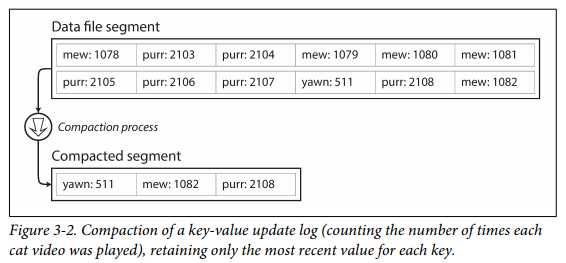
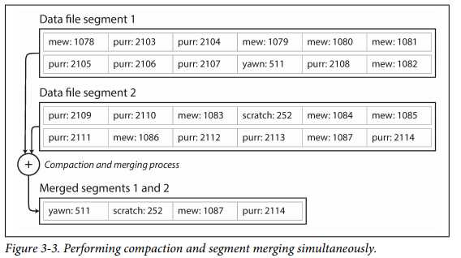
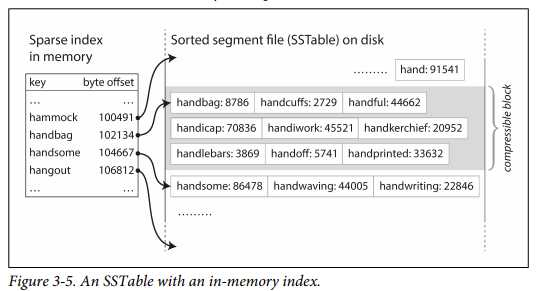
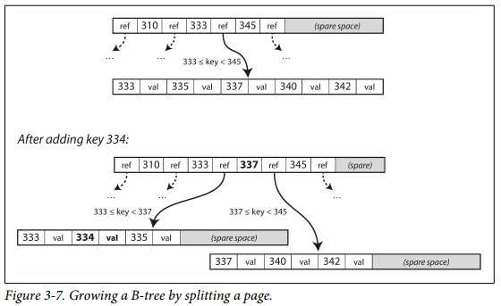

# CHAPTER 3 - Storage and Retrieval

Two families of storage engines: 
- Log-structured storage engines 
- Page-oriented storage engines such as B-trees.

## Data Structures That Power Your Database
```
#!/bin/bash
db_set () {
echo "$1,$2" >> database 
}
db_get () {
    grep "^$1," database | sed -e "s/^$1,//" | tail -n 1 
}
```
-  db_set key value : to store key and value in the database

```
$ db_set 123456 '{"name":"London","attractions":["Big Ben","London Eye"]}' 
$ db_set 42 '{"name":"San Francisco","attractions":["Golden Gate Bridge"]}' 
$ db_get 42
{"name":"San Francisco","attractions":["Golden Gate Bridge"]}
```
- a text file where each line contains a key-value pair, separated by a comma
- Every call to db_set appends to the end of the file, so if you update a key several times, the old versions of the value are not overwritten

```
$ db_set 42 '{"name":"San Francisco","attractions":["Exploratorium"]}' 
$ db_get 42
{"name":"San Francisco","attractions":["Exploratorium"]} 
$ cat database
123456,{"name":"London","attractions":["Big Ben","London Eye"]} 
42,{"name":"San Francisco","attractions":["Golden Gate Bridge"]} 
42,{"name":"San Francisco","attractions":["Exploratorium"]}
```
> db_set function
- It actually has pretty good performance for something that is so simple, because appending to a file is generally very efficient.
- Similarly to what db_set does, many databases internally use a log, which is an append-only data file.

> db_get function
- It has terrible performance if you have a large number of records in your database. 
- Every time you want to look up a key, db_get has to scan the entire database file from beginning to end, looking for occurrences of the key.
- The cost of a lookup is O(n)

> To make it efficient: **Index**
- An index is an additional structure that is derived from the primary data
- The general idea behind them is to keep some additional metadata on the side
- This doesn’t affect the contents of the database; it only affects the performance of queries.
- Maintaining additional structures incurs overhead, especially on writes.
- Any kind of index usually slows down writes, because the index also needs to be updated every time data is written.
- Trade-off: well-chosen indexes speed up read queries, but every index slows down writes.
- Not necessary, But the application developer or database administrator can then choose the indexes that give your application the greatest benefit, without introducing more overhead than necessary.

**Let's talk about Index!!**

## Hash Indexes
- indexes for key-value data
- Dictionary type(as a hash map (hash table))
- Whenever you append a new key-value pair to the file, you also update the hash map to reflect the offset of the data you just wrote
- When you want to look up a value, use the hash map to find the offset in the data file, seek to that location, and read the value.

**Frequent update of each key**

Bitcask offers high-performance reads and writes, subject to the requirement that all the keys fit in the available RAM, since the hash map is kept completely in memory.
i.e.)


**running out of disk space?**

A good solution is 
1. to break the log into segments of a certain size by closing a segment file when it reaches a certain size, and making subsequent writes to a new segment file.
2. We can then perform **compaction** on these segments
   ( **compaction**: throwing away duplicate keys in the log, and keeping only the most recent update for each key)
   


4. Moreover, since compaction often makes segments much smaller (assuming that a key is overwritten several times on average within one segment),
   we can also merge several segments together at the same time as performing the compaction, as shown in Figure 3-3.
5. no modification. written to new file. Merging and Compaction in the background thread.
  

#### Some Issues in a real implementation 
1. File format
```
CSV is not the best format for a log. It’s faster and simpler to use a binary format 
that first encodes the length of a string in bytes, followed by the raw string (without need for escaping).
```
2. Deleting records
```
If you want to delete a key and its associated value, you have to append a special deletion record to the data file(called a tombstone).
When log segments are merged, the tombstone tells the merging process to discard any previous values for the deleted key.
```
3. Crash recovery
```
If the database is restarted, the in-memory hash maps are lost. In principle, you can restore each segment’s hash map
by reading the entire segment file from beginning to end and noting the offset of the most recent value for every key as you go along.
However, that might take a long time if the segment files are large, which would make server restarts painful.
Bitcask speeds up recovery by storing
```
4. Partially written records
```
The database may crash at any time, including halfway through appending a record to the log.
Bitcask files include checksums, allowing such corrupted parts of the log to be detected and ignored.
```
5. Concurrency control
```
As writes are appended to the log in a strictly sequential order, a common implementation choice is to have only one writer thread.
Data file segments are append-only and otherwise immutable, so they can be read concurrently by multiple threads.

Why Append-only? not Update?
• Appending and segment merging are sequential write operations, which are generally much faster than random writes,
  especially on magnetic spinning-disk hard drives.
  To some extent sequential writes are also preferable on flash-based solid state drives (SSDs)
• Concurrency and crash recovery are much simpler if segment files are append-only or immutable.
    For example, you don’t have to worry about the case where a crash happened
    while a value was being overwritten, leaving you with a file containing part of the old and part of the new value spliced together.
•  Merging old segments avoids the problem of data files getting fragmented over time.
```

### limitations of the hash table index

• The hash table must fit in memory
```
  Not for a very large number of keys.
    it is difficult to make an on-disk hash map perform well.
    It requires a lot of random access I/O, it is expensive to grow when it becomes full, and hash collisions require fiddly logic  
```

• Range queries are not efficient. 
```
i.e. you cannot easily scan over all keys between kitty00000 and kitty99999—you’d have to look up each key individually in the hash maps.
```

### SSTables and LSM-Trees
 Then, how to avoid the limitation? - SSTables and LSM-Trees(an indexing structure)

 **SST(Sorted String Table)**
 Advantages
 1. Merging segments is simple and efficient, even if the files are bigger than the available memory.
        The approach is like the one used in the mergesort algorithm and is illustrated in Figure 3-4.
    
  

   What if the same key appears in several input segments? 
    When multiple segments contain the same key, we can keep the value from the most recent segment and discard the values in older segments.
    
 2. In order to find a particular key in the file, you no longer need to keep an index of all the keys in memory.
    You still need an in-memory index to tell you the offsets for some of the keys,
        but it can be sparse: one key for every few kilobytes of segment file is sufficient, because a few kilobytes can be scanned very quickly.
 
  
 
  3. Since read requests need to scan over several key-value pairs in the requested range anyway,
     it is possible to group those records into a block and compress it before writing it to disk (indicated by the shaded area in Figure 3-5).
     Each entry of the sparse in-memory index then points at the start of a compressed block. 
     Besides saving disk space, compression also reduces the I/O bandwidth use.

#### Constructing and maintaining SSTables

- When a write comes in, add it to an in-memory balanced tree data structure (for example, a red-black tree). This in-memory tree is sometimes called a **memtable**.
- When the memtable gets bigger than some threshold—typically a few megabytes write it out to disk as an SSTable file.
  This can be done efficiently because the tree already maintains the key-value pairs sorted by key. The new SSTable file becomes the most recent segment of the database.
  While the SSTable is being written out to disk, writes can continue to a new memtable instance.
- In order to serve a read request, first try to find the key in the memtable, then in the most recent on-disk segment, then in the next-older segment, etc.
- From time to time, run a merging and compaction process in the background to combine segment files and to discard overwritten or deleted values.

#### Making an LSM-tree out of SSTables

#### Performance optimizations
A Bloom filter is a memory-efficient data structure for approximating the contents of a set. 
It can tell you if a key does not appear in the database, and thus saves many unnecessary disk reads for nonexistent keys.
- In size-tiered compaction, newer and smaller SSTables are successively merged into older and larger SSTables.
- In leveled compaction, the key range is split up into smaller SSTables
  and older data is moved into separate “levels,” which allows the compaction to proceed more incrementally and use less disk space.

### B-Trees
- The most widely used indexing structure is quite different: the B-tree.
- B-trees keep key-value pairs sorted by key, which allows efficient key-value lookups and range queries.
  But that’s where the similarity ends: B-trees have a very different design philosophy.
- B-trees break the database down into fixed-size blocks or pages, traditionally 4 KB in size (sometimes bigger), and read or write one page at a time.
  This design corresponds more closely to the underlying hardware, as disks are also arranged in fixed-size blocks.
- Each page can be identified using an address or location, which allows one page to refer to another—similar to a pointer, but on disk instead of in memory.

  
 - One page is designated as the root of the B-tree; whenever you want to look up a key in the index, you start here.
   The page contains several keys and references to child pages.
   Each child is responsible for a continuous range of keys, and the keys between the references indicate where the boundaries between those ranges lie.
- The number of references to child pages in one page of the B-tree is called the **branching factor**.

  
- This algorithm ensures that the tree remains balanced: a B-tree with n keys always has a depth of O(log n).
  Most databases can fit into a B-tree that is three or four levels deep, so you don’t need to follow many page references to find the page you are looking for.
  (A four-level tree of 4 KB pages with a branching factor of 500 can store up to 256 TB.)

#### Making B-trees reliable
