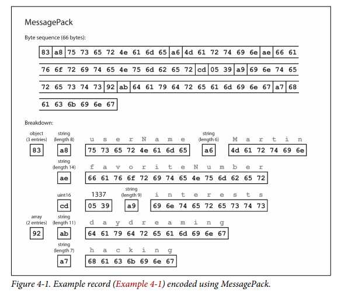
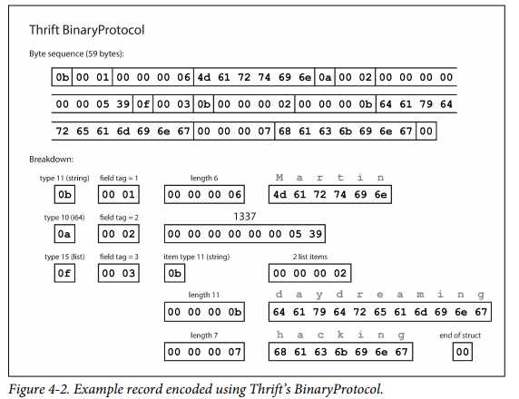
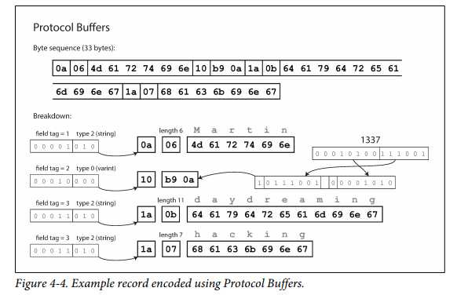
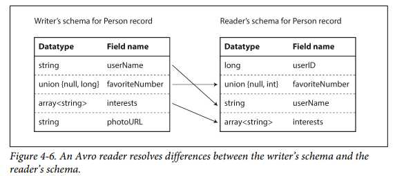
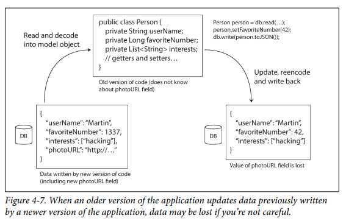

# CHAPTER 4 Encoding and Evolution

- In this chapter we will look at *several formats* for encoding data, including JSON, XML, Protocol Buffers, Thrift, and Avro. 
- In particular, we will look at
   - *Schema Change* - how they handle schema changes and
   - *Compatibility* - how they support systems where old and new data and code need to coexist


#### In order for the system to continue running smoothly, we need to maintain compatibility in both directions:

- [Backward compatibility]
   - Newer code can read data that was written by older code.
   - Backward compatibility is normally not hard to achieve: as author of the newer code, you know the format of data written by older code, and so you can explicitly handle it (if necessary by simply keeping the old code to read the old data).

- [Forward compatibility]
    - Older code can read data that was written by newer code.
    - Forward compatibility can be trickier, because it requires older code to ignore additions made by a newer version of the code.

## Formats for Encoding Data
Normally, Two different data representations that Programs work with 
1. Data in memory which is kept in objects, structs, lists, arrays, hash tables, trees, and so on.
2. Encoded data to be written in a file or sent it over the network which has self-contained sequence of bytes(i.e. JSON)

- Encoding : the Translation from the in-memory representation to a byte sequence (also known as serialization or marshalling)
- Decoding : the Reverse of the encoding(parsing, deserialization, unmarshalling)

### Language-Specific Formats
> Encoding libraries in many programming languages for encoding in-memory objects into byte sequences.
```
- Java: java.io.Serializable
- Ruby: Marshal
- Python: pickle
- Third-party: Kryo for Java
```

- *Convenient*: Minimal additional code is used because *Encoding libraries* allow in-memory objects to be saved and restored.
- *Problem*:
1. Compatible issue b/w differnet languages:
   - A particular program language might not be able to be read the encoded data by another language.
2. Security issue :
   - In order to restore data in the same object types, the decoding process needs to instantiate arbitrary classes.
   ```
   That is,
   -> Attackers can get your application to decode an arbitrary byte sequence
   -> they can instantiate arbitrary classes -> they can do terrible things(such as remotely executing arbitrary code).
   ```
3. Compatible issue b/w differnet versions:
   - Versioning data is often an afterthought in these libraries: as they are intended for quick and easy encoding of data, they often neglect the inconvenient problems of *forward and backward compatibility*.
4. Efficiency (CPU time taken to encode or decode, and the size of the encoded structure) is also often an afterthought.
   - (For example, Java’s built-in serialization is notorious for its bad performance and bloated encoding).

> ==> For these reasons it’s generally a bad idea to use your language’s built-in encoding for anything other than very transient purposes.

&nbsp;

### JSON, XML, and Binary Variants
- JSON & XML : Standardized encodings (widely known, widely supported, and almost as widely disliked)
   - XML : often criticized for being too verbose and unnecessarily complicated.
   - JSON : popular due to its built-in support in web browsers and simplicity relative to XML.
   - CSV : another popular language-independent format
   - Textual formats / human-readable
   - But, Subtle problems:
      1. There is a lot of ambiguity around the encoding of numbers.
         - XML & CSV: cannot distinguish b/w numbers and string+digits
         - JSON: cannot distinguish integers and floating-point numbers
         - This is a problem when dealing with large numbers(i.e.  > 2^53); 
      2. JSON and XML don’t support binary strings (sequences of bytes without a character encoding), but they have good support for Unicode character strings (i.e., human- readable text).
      3. If applications don’t use XML/JSON schemas, then they need to *potentially hardcode* the appropriate encoding/decoding logic instead.(Since the interpretation depends on information in the schema)
      4. CSV does not have any schema, so the application needs to define the meaning of each row and column. If an application change adds a new row or column, you have to handle that change manually.

> ==> Despite these flaws, JSON, XML, and CSV are good enough for many purposes(data interchange formats b/w different organizations)
Because as long as people agree on what the format is, it often doesn’t matter how pretty or efficient the format is. 

#### Binary encoding
- Because of using *a lot of space* in the textual versions(JSON and XML), binary encodings for JSON and XML were developed.
   - Binary encodings for JSON: *MessagePack*, BSON, BJSON, UBJSON, BISON, and Smile
   - Binary encodings for XML: WBXML and Fast Infoset
- No prescribed schema in formats above -> So, they need to include all the object field names

```json
//Example 4-1. Example record which we will encode in several binary formats in this chapter
{
  "userName": "Martin", 
  "favoriteNumber": 1337,
  "interests": ["daydreaming", "hacking"] 
}
```


**Encoded JSON document with MessagePack**
- [Indicator / Meaning]
   - 1st byte, 0x83 : Ox -> Hexadecimal / Top 4 bits 0x80 -> a map with key-value pairs / Bottom 4 bits = 0x03 -> three key-value pairs.
   - 2nd byte, 0xa8 : 0xa0(Top 4 bits) -> string / 0x08(bottom 4 bits) - > 8 bytes long.
   - 3rd 8 bytes:  Field name 'userName' in ASCII.
   - 4th byte, 0xa6: six-letter string inficator
   - 5th 6 byte: string value 'Martin' and so on.   
- The binary encoding 66 bytes long ( a little less than textual JSON encoding(81 bytes) (with whitespace removed)).
- But, such a small space reduction

&nbsp;

### Thrift and Protocol Buffers
- how we can do much better, and encode the same record in just 32 bytes.
- Apache Thrift (Facebook) and Protocol Buffers (a.k.a protobuf/ Google) binary encoding libraries
- They come with *a code generation tool* that takes *a schema definition* like the ones shown here, and produces classes that implement the schema in various programming languages 
```
// Thrift interface definition language (IDL)
struct Person {
  1: required string       userName,
  2: optional i64          favoriteNumber, 
  3: optional list<string> interests
}
```

```
//Protocol Buffers
message Person {
  required string user_name = 1; 
  optional int64 favorite_number = 2; 
  repeated string interests = 3;
}
```
- **Thrift** : two different binary encoding formats 'BinaryProtocol' & 'CompactProtocol'

> **(1) Thrift - BinaryProtocol** 



- [Similarity]
   - a type annotation (to indicate whether it is a string, integer, list, etc.) 
   - a length indication (length of a string, number of items in a list).
   - Strings encoded as ASCII (or rather, UTF-8)
- [Difference]
   - No field names (userName, favoriteNumber, interests).
   - Instead, field tags(schema definition)- numbers (1, 2, and 3)

- ==> 59 byte

> **(2) Thrift - CompactProtocol**


- ==> only 34 bytes
- by packing the *'field type'* and *'tag number'* into a single byte
- by using variable-length integers
- Number 1337 => encoded in two bytes (the top bit indicator -> still more bytes to come? )
- That is, '–64 ~ 63' --encoded--> 1 byte and '–8192 ~ 8191' --encoded--> 2 byte

>**(3) Protocol Buffers (which has only one binary encoding format)**



- ==> only 33 bytes
- bit packing slightly differently, but is otherwise very similar to Thrift’s CompactProtocol.

#### *Field tags* and schema evolution
- Schema Evolution : Schemas inevitably need to change over time
- How do Thrift and Protocol Buffers handle schema changes while keeping backward and forward compatibility?

> First, Field’s tags are important!!
- You can change a field's name in the schema, since the encoded data never refers to field names,
- But, you can**not** change a field’s tag in the schema, since that would make all existing encoded data invalid.

[Explain]
> Forward compatibility: (old code can read records that were written by new code)
- If you add new fields to the schema with new tag numbers
   - Then, Old code can skip it using the datatype annotation   

> Backward compatibility: (new code can read records that were written by old code)
- If you add a new field
   - New code can not read data written by old code
   - So, the added fields must be optional or have a default value.
 
#### ==> This way, we can maintain the compatibility. (Removing a field is just like adding a field)

#### *Datatypes* and schema evolution
- What about changing the datatype of a field?
- there is a risk that values will lose precision or get truncated.
   - For example, say you change a 32-bit integer into a 64-bit integer
   - Old Data <==Read== New code: OK - The Parser can fill in missing bits with zeros.
   - Old Code(still 32-bit) ==Read==> New Data: Error - It will be truncated.
- A curious detail of 'Protocol Buffers'
   - No list or array datatype
   - Instead, a repeated marker for fields ( Two 'filed tag =3 type = string' in Figure 4-4)
   - The nice effect: it’s okay to change an optional (single-valued) field into a repeated (multi-valued) field. 
   - New code reading old data sees a list with zero or one element (depending on whether the field was present).
   - Old code reading new data sees only the last element of the list cuz they think the only last element can be multiple. 
- 'Thrift' has a dedicated list datatype
   - It is parameterized with the data type of the list elements
   - not allow the same evolution from single-valued to multi-valued as Protocol Buffers
   - but it has the advantage of supporting nested lists
 
     
### Apache Avro

- Another binary encoding format
-  It was started in 2009 as a subproject of Hadoop, as a result of Thrift not being a good fit for Hadoop’s use cases.
-  Hadoop: a framework that allows for the distributed processing of large data sets across clusters of computers using simple programming models.
-  Avro also uses a schema to specify the structure of the data being encoded. It has two schema languages:
   -  one (Avro IDL) intended for human editing,

```
Our example schema, written in Avro IDL, might look like this:
record Person { 
   string    userName;
   union { null, long } favoriteNumber = null; 
   array<string>        interests;
}
```

   -  and one (based on JSON) that is more easily machine-readable.
```
{
The equivalent JSON representation of that schema is as follows:
   "type": "record", 
   "name": "Person", 
   "fields": [
      {"name": "userName",       "type": "string"},
      {"name": "favoriteNumber", "type": ["null", "long"], "default": null}, 
      {"name": "interests",      "type": {"type": "array", "items": "string"}}
   ]
}
```

[Characteristics - Avro binary encoding]
- No tag numbers in the schema
- For the figure 4-1 case, it uses just 32 bytes long which is compact.


- No identify fields or their datatypes.
- concatenated values together
- The type is encoded using a variable-length encoding (the same as Thrift’s CompactProtocol).

#### The writer’s schema and the reader’s schema
- ✔ writer’s schema:
   - The schema that is used for applications to encode some data     
- ✔ reader’s schema:
   -  The schema that is used for applications to decode some data     
- ✔ Key Idea in Avro.
   - The writer’s schema and the reader’s schema don’t have to be the same—they only need to be compatible by **Field Name*
- If the code reads data expecting some field, But no field info in the writer’s schema
   - Then, a **Default Value* declared in the reader’s schema.



#### Schema evolution rules 
- To maintain forward/backward compatibility, you may only add or remove a field that has a default value.
> For example,
```
case 1)
you add a field with default value && new field in the new schema, but not the old one
When reader with new schema ---read--- old schema record ==>  Then, Default value (Read OK)

case 2-1)
you 'Add' a field with 'NO' default value && new field in the new schema, but not the old one
When reader with new schema ---read--- old schema record ==>  Then, No Default value (Read Error -> backward compatibility Error)

case 2-2)
you 'Remove' a field with 'NO' default value && new field in the new schema, but not the old one
When reader with old schema ---read--- new schema record ==>  Then, No Default value (Read Error -> forward compatibility Error)
```

- Also, Null is not an acceptable default for Avro
     - Instead, Union type is allowed (i.e., * union { null, long, string } field;*)
       
-  Consequently, Avro : no optional and required markers /  instead, union types / default values  


#### But what is the writer’s schema?
- How does the reader know the writer’s schema with which a particular piece of data was encoded?
- can’t include the entire schema => too much bigger than the encoded data
- Answer? It depends in context in Avro being used  
   - Large file with lots of records :
      - Writer’s schema included once at the beginning of the file
      -  all encoded with the same schem
   - Database with individually written records
      - In a database, different records / different points in time / different writer’s schemas
      - How?
      - include a version number at the beginning of every encoded record, and to keep a list of schema versions in your database.
   - Sending records over a network connection
      - When two processes are communicating over a bidirectional network connection
      - the negotiated schema version for the lifetime of the connection.
      - It's how Avro RPC protocol works.
    
#### Dynamically generated schemas
- Advantage of Avro’s approach- No Tag Number in Avro unlike Protocol Buffers and Thrift( why is it important?)
- cuz Avro is friendlier to **dynamically generated schemas**.
> Example
```
- say you have a relational database
- you want to dump contents in DB to a file
- also you want to use binary format, not the textual format

- In the case of Avro
   - you can fairly easily generate an Avro schema from the relational schema and encode the database contents
   - Because,
      - each DB column  ==> a field in Avro.
      - DB column names ==> field names in Avro.
      - So, schema changes is not that hard
      - And the updated writer’s schema can still be matched up with the old reader’s schema because the field name is identical.

- By contrast, in the case of 'Thrift' or 'Protocol Buffers'
   - the field tags have to be assigned by hand
```

#### Code generation and dynamically typed languages
> 'Thrift and Protocol Buffers' rely on code generation
- By using a programming language, you can implements this schema.
   -  Code generation is useful in statically typed languages(Java, C++, or C#)
      -  1. Because of efficient in-memory structures for decoded data
         2. IDE - type checking and autocompletion
   -  Code generation is pointless in dynamically typed languages(JavaScript, Ruby, or Python)
      -  Because of no compile-time for type checker

By contrast

> 'Avro' provides optional code generation(with/without any code generation)
- by using an object container file (which embeds the writer’s schema), you can simply *open* it using the Avro library and look at the data for *analysis*
- The file is self-describing since it includes all the necessary metadata.

### The Merits of Schemas
- More compact than the various “binary JSON” variants
   - since they can omit field names from the encoded data
- The schema is a valuable form of documentation
   - because the schema is required for decoding, you can be sure that it is up to date (whereas manually maintained documentation may easily diverge from reality).
- Keeping a database of schemas allows you to check forward and backward compatibility of schema changes, before anything is deployed.
- For statically typed programming languages, generate code from the schema is useful
   - since it enables type checking at compile time.


## Modes of Dataflow
- That’s a fairly abstract idea—there are many ways data can flow from one process to another. 
- Who encodes the data, and who decodes it?
- In the rest of this chapter we will explore some of the most common ways how data flows between processes:
```
•  Via databases (see “Dataflow Through Databases” on page 129)
•  Via service calls (see “Dataflow Through Services: REST and RPC” on page 131)
•  Via asynchronous message passing (see “Message-Passing Dataflow” on page 136)
```
### Dataflow Through Databases

- In general, it’s common for several different processes to be accessing a database at the same time.
- Either way, in an environment where the application is changing, it is likely that some processes accessing the database will be running newer ode and some will be running older code—for example because a new version is currently being deployed in a rolling upgrade, so some instances have been updated while others haven’t yet.
- sometimes you need to take care at an application level, as illustrated in Figure 4-7. For example, if you decode a database value into model objects in the application, and later reencode those model objects, the unknown field might be lost in that translation process. Solving this is not a hard problem; you just need to be aware of it.

#### Different values written at different times
- within a single database you may have some values that were written five milliseconds ago, and some values that were written five years ago.
- Rewriting (migrating) data into a new schema is certainly possible, but it’s an expensive thing to do on a large dataset, so most databases avoid it if possible.
- Most relational databases allow simple schema changes, such as adding a new column with a null default value, without rewriting existing data.

#### Archival storage  
- Perhaps you take a snapshot of your database from time to time, say for backup purposes or for loading into a data warehouse
- In this case, the data dump will typically be encoded using the latest schema, even if the original encoding in the source database contained a mixture of schema versions from different eras.
- As the data dump is written in one go and is thereafter immutable, formats like Avro object container files are a good fit.

## Dataflow Through Services: REST and RPC
- The most common arrangement is to have two roles: clients and servers.
- The servers expose an API over the network, and the clients can connect to the servers to make requests to that API.
- The API exposed by the server is known as a service.

> WEB
- clients (web browsers) make requests to web servers, making GET requests to download HTML, CSS, JavaScript, images, etc.,
- and making POST requests to submit data to the server.
- The API consists of a standardized set of protocols and data formats (HTTP, URLs, SSL/TLS, HTML, etc.).
- Web browsers are not the only type of client.
     For example, a native app running on a mobile device or a desktop computer can also make network requests to a server,
     and a client-side JavaScript application running inside a web browser can use XMLHttpRequest to become an HTTP client (this technique is known as Ajax [30]).
- In this case, the server’s response is typically not HTML for displaying to a human, but rather data in an encoding that is convenient for further processing by the client-side application code (such as JSON)
- Moreover, a server can itself be a client to another service (for example, a typical web app server acts as client to a database).
- This approach is often used to decompose a large application into smaller services by area of functionality, such that one service makes a request to another when it requires some functionality or data from that other service.
- This way of building applications has traditionally been called a service-oriented architecture (SOA), more recently refined and rebranded as microservices architecture [31, 32].
- A key design goal of a service-oriented/microservices architecture is to make the application easier to change and maintain by making services independently deployable and evolvable.

### Web Service
1. A client application running on a user’s device (e.g., a native app on a mobile device, or JavaScript web app using Ajax) making requests to a service over HTTP. These requests typically go over the public internet.
2. One service making requests to another service owned by the same organization, often located within the same datacenter, as part of a service-oriented/microservices architecture. (Software that supports this kind of se case is sometimes called middleware.)
3. One service making requests to a service owned by a different organization, usually via the internet. This is used for data exchange between different organizations’ backend systems. This category includes public APIs provided by online services, such as credit card processing systems, or OAuth for shared access to user data.

#### REST and SOAP
> REST
- REST is not a protocol, but rather a design philosophy that builds upon the principles of HTTP [34, 35].
- It emphasizes simple data formats, using URLs for identifying resources and using HTTP features for cache control, authentication, and content type negotiation.
- REST has been gaining popularity compared to SOAP, at least in the context of cross-organizational service integration [36], and is often associated with microservices [31].
- An API designed according to the principles of REST is called RESTful.

> SOAP
- SOAP is an XML-based protocol for making network API requests.
- Although it is most commonly used over HTTP, it aims to be independent from HTTP and avoids using most HTTP features.
- Instead, it comes with a sprawling and complex multitude of related standards (the web service framework, known as WS-*) that add various features
- The API of a SOAP web service is described using an XML-based language called the Web Services Description Language, or WSDL. WSDL enables code generation so that a client can access a remote service using local classes and method calls (which are encoded to XML messages and decoded again by the framework).
- This is useful in statically typed programming languages, but less so in dynamically typed ones
- As WSDL is not designed to be human-readable, and as SOAP messages are often too complex to construct manually, users of SOAP rely heavily on tool support, code generation, and IDEs

#### The problems with remote procedure calls (RPCs)
- All of these are based on the idea of a remote procedure call (RPC), which has been around since the 1970s [42]. The RPC model tries to make a request to a remote network service look the same as calling a function or method in your programming language, within the same process (this abstraction is called location transparency). 
- Although RPC seems convenient at first, the approach is fundamentally flawed 

- A local function call is predictable and either succeeds or fails, depending only on parameters that are under your control.
- A network request is unpredictable: the request or response may be lost due to a network problem, or the remote machine may be slow or unavailable, and such problems are entirely outside of your control.
- Network problems are common, so you have to anticipate them, for example by retrying a failed request.

> network request vs a local function call
  
- A local function call either returns a result, or throws an exception, or never returns (because it goes into an infinite loop or the process crashes). A network request has another possible outcome: it may return without a result, due to a timeout. 
  
- If you retry a failed network request, it could happen that the requests are actually getting through, and only the responses are getting lost. In that case, retrying will cause the action to be performed multiple times, unless you build a mechanism for deduplication (idempotence) into the protocol. Local function calls don’t have this problem. (We discuss idempotence in more detail in Chapter 11.)
  
- Every time you call a local function, it normally takes about the same time to execute. A network request is much slower than a function call, and its latency is also wildly variable: at good times it may complete in less than a millisecond, but when the network is congested or the remote service is overloaded it may take many seconds to do exactly the same thing.
  
-  When you call a local function, you can efficiently pass it references (pointers) to objects in local memory. When you make a network request, all those parameters need to be encoded into a sequence of bytes that can be sent over the network. That’s okay if the parameters are primitives like numbers or strings, but quickly becomes problematic with larger objects.

-    The client and the service may be implemented in different programming languages, so the RPC framework must translate datatypes from one language into another.
This can end up ugly, since not all languages have the same types—recall JavaScript’s problems with numbers greater than 253, for example (see “JSON, XML, and Binary Variants” on page 114). This problem doesn’t exist in a 
single process written in a single language.

 #### Current directions for RPC
 
