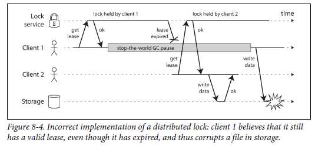
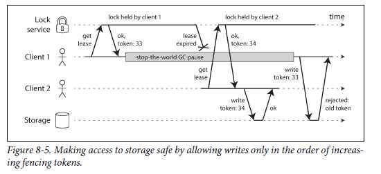

# CHAPTER 8 - The Trouble with Distributed Systems

## Faults and Partial Failures
> Why is it difficult to deal with the Distributed Systems?

- A single computer
  - fairly predictable: either it works or it doesn’t
  - mostly just a consequence of badly written software
  - If there is a hardware problem (e.g., memory corruption or a loose connector), the consequence is usually a total system failure.

- Distributed system
  - Partial Failures: some parts of the system that are broken in some unpredictable way, but others are fine.
  - In multiple nodes and the network -> sometimes work and sometimes unpredictably fail.
  - If we want to make distributed systems work, we must accept the possibility of partial
failure and build fault-tolerance mechanisms into the software.
- For the distributed systems, we must accept the possibility of partial failure and build fault-tolerance mechanisms into the software. In other words, we need to build a reliable system from unreliable components.

### Features of the Distributed System
- Supercomputer
  - A single-node computer 
  - partial failure ==> total failure(everything crashs)

- Distributed System
  - Many internet-related applications are online, in the sense that they need to be able to serve users with low latency at any time.
  -  Nodes in cloud services are built from commodity machines, which can provide equivalent performance at lower cost due to economies of scale, but also have higher failure rates.
  -  Large datacenter networks are often based on IP and Ethernet.
  -  In a system with thousands of nodes, it is reasonable to assume that something is always broken.
  -  If the system can tolerate failed nodes and still keep working as a whole, that is a very useful feature for operations and maintenance
  -  Communication most likely goes over the internet, which is slow and unreliable compared to local networks.

> Again, we need to build a reliable system from unreliable components and we must accept the possibility of partial failure and build fault-tolerance mechanisms into the software.

## Unreliable Networks

- The internet and most internal networks in datacenters (often Ethernet) are *asynchronous packet networks*.
- In this kind of network, one node can send a message (a packet) to another node, but the network gives no guarantees as to when it will arrive, or whether it will arrive at all.
  
- If you send a request and don’t get a response, the reason for that is the following 3 thing.

  - (a) Request was lost, 
  - (b) Remote node is down, or 
  - (c) Response was lost.

- Timeout : The usual way of handling the issue
  - After some time you give up waiting and assume that the response is not going to arrive.
 
    
### Network Faults in Practice
- Building a reliable network is still not an easy task.
- adding redundant networking gear doesn’t reduce faults as much as you might hope
- The software needs to be able to handle them, Considering faults can occur.
- Handling network faults doesn’t necessarily mean tolerating them
  - Show an error message to users while your network is in problems.
  - However, by having software react to network problems, you should ensure that the system can recover from them.

### Detecting Faults
- In some specific circumstances you might get some feedback to explicitly tell you that something is not working.
- Unfortunately, however, the uncertainty about the network makes it difficult to tell whether a node is working or not.

### Timeouts and Unbounded Delays
- If a timeout is the only sure way of detecting a fault, then how long should the timeout
be? There is unfortunately no simple answer.
- most systems we work with have neither of those guarantees: asynchronous networks have unbounded delays (that is, they try to deliver packets as quickly as possible, but there is no upper limit on the time it may take for a packet to arrive), and most server implementations cannot guarantee that they can handle
requests within some maximum time (see “Response time guarantees” on page 298).
- For failure detection, it’s not sufficient for the system to be fast most of the time: if your timeout is low, it only takes a transient spike in round-trip times to throw the system off-balance.

#### Network congestion and queueing
- the variability of packet delays on computer networks is most often due to queueing 
- • If several different nodes simultaneously try to send packets to the same destination, the network switch must queue them up and feed them into the destination network link one by one (as illustrated in Figure 8-2). On a busy network link, a packet may have to wait a while until it can get a slot (this is called network congestion). 
If there is so much incoming data that the switch queue fills up, the packet is dropped, so it needs to be resent—even though the network is functioning fine.
• When a packet reaches the destination machine, if all CPU cores are currently busy, the incoming request from the network is queued by the operating system until the application is ready to handle it. Depending on the load on the machine, this may take an arbitrary length of time.
• In virtualized environments, a running operating system is often paused for tens of milliseconds while another virtual machine uses a CPU core. During this time, the VM cannot consume any data from the network, so the incoming data is queued (buffered) by the virtual machine monitor [26], further increasing the variability of network delays.
• TCP performs flow control (also known as congestion avoidance or backpressure), in which a node limits its own rate of sending in order to avoid overloading a network link or the receiving node [27]. This means additional queueing at the sender before the data even enters the network.
• Moreover, TCP considers a packet to be lost if it is not acknowledged within some timeout (which is calculated from observed round-trip times), and lost packets are automatically retransmitted. Although the application does not see the packet loss and retransmission, it does see the resulting delay (waiting for the timeout to expire, and then waiting for the retransmitted packet to be acknowledged).

> TCP Versus UDP
- Some latency-sensitive applications, such as videoconferencing and Voice over IP (VoIP), use UDP rather than TCP. It’s a trade-off between reliability and variability of delays: as UDP does not perform flow control and does not retransmit lost packets, it avoids some of the reasons for variable network delays (although it is still susceptible to switch queues and scheduling delays).
- UDP is a good choice in situations where delayed data is worthless. For example, in a VoIP phone call, there probably isn’t enough time to retransmit a lost packet before its data is due to be played over the loudspeakers. In this case, there’s no point in retransmitting the packet—the application must instead fill the missing packet’s time slot with silence (causing a brief interruption in the sound) and move on in the stream. The retry happens at the human layer instead. (“Could you repeat that please? The sound just cut out for a moment.”)

- In public clouds and multi-tenant datacenters, you can determine an appropriate trade-off between failure detection delay and risk of premature timeouts.

- Even better, rather than using configured constant timeouts, systems can continually measure response times and their variability (jitter), and automatically adjust timeouts according to the observed response time distribution

### Synchronous Versus Asynchronous Networks

> Datacenter networks vs Traditional fixed-line telephone network(non-cellular, non-VoIP)

- Traditional fixed-line telephone network(non-cellular, non-VoIP)
  - circuit-switched networks 
  - Extremely reliable
  - requires a constantly low end-to-end latency 
  - How it works?
    - When you make a call over the telephone network, it establishes a *circuit*
    - This circuit remains in place until the call ends.
    - A circuit is a fixed amount of reserved bandwidth which nobody else can use while the
circuit is established.
  - Synchronous ( no suffering from Queueing )
  - Bounded delay: maximum end-to-end latency of the network is fixed
      
- Datacenter networks
  - Packet-switched protocols 
  - TCP connection
  - Optimized for bursty traffic
  - use whatever network bandwidth is available
  - A variable-sized block of data(e.g., an email or a web page)
  - transfer data in the shortest time possible.
  - While a TCP connection is idle, it doesn’t use any bandwidth.
  - Unbounded delays: Suffer from queueing
  - Requesting a web page / Sending an email / Transferring a file
  -  no particular bandwidth
  -  as quickly as possible

## Unreliable Clocks
- In a distributed system, time is a tricky business, because communication is not
instantaneous.
- The time when a message is received is always later than the time when it is sent, but due to variable delays in the network, we don’t know how much later.
- Each machine on the network has its own clock with its own notion of time.
- This fact sometimes makes it difficult to determine the order in which things happened when multiple machines are involved, 

### Monotonic Versus Time-of-Day Clocks 
- Modern computers have at least two different kinds of clocks: a time-of-day clock and
a monotonic clock.

#### Time-of-day clocks
- Returns the current date and time according to the reference point each system has (usually midnight of January 1, 1970 UTC)
- Time-of-day clocks are usually synchronized with NTP(Network Time Protocol)
- Not suitable for measuring elapsed time
  - cuz 1. it may *jump back* in time if the local clock is too far ahead of the NTP server.
  - cuz 2. ignore *leap seconds(23:59:60* <> 00:00:00)
    
#### Monotonic clocks
- A monotonic clock is suitable for measuring a duration (time interval: timeout or service’s response time)
  - for example, clock_gettime(CLOCK_MONOTONIC) on Linux / System.nanoTime() in Java.
- comparing two monotonic clock values from two different computers is meaningless - not same
- By default, NTP allows the clock rate to be speeded up or slowed down by up to 0.05%, but NTP cannot cause the monotonic clock to jump forward or backward.
- In a distributed system, using a monotonic clock for measuring elapsed time (e.g.,timeouts) is usually fine, because it doesn’t assume any synchronization between different nodes’ clocks and is not sensitive to slight inaccuracies of measurement.

### Clock Synchronization and Accuracy
  

